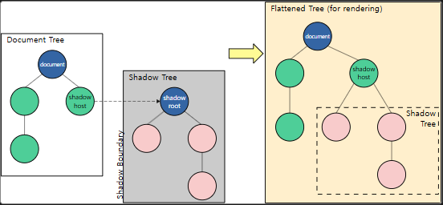
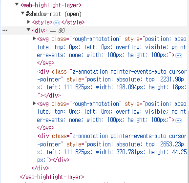
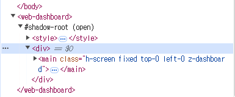

# 🖍 Attention

<div align="center">
  <b>긴 글 읽기를 돕는 크롬 익스텐션</b><br/>
  <b>서비스 자체 가이드라인 하이라이트와 자유로운 주석 표시 및 메모 기능 제공</b>
</div>

<br />

<div align="center">
  
</div>

<br />

# 목차

<!-- toc -->

- [1. 기획 의도 및 목적](#1-%EA%B8%B0%ED%9A%8D-%EC%9D%98%EB%8F%84-%EB%B0%8F-%EB%AA%A9%EC%A0%81)
  * [1) 기획 의도](#1-%EA%B8%B0%ED%9A%8D-%EC%9D%98%EB%8F%84)
  * [2) 목적 및 기대 효과](#2-%EB%AA%A9%EC%A0%81-%EB%B0%8F-%EA%B8%B0%EB%8C%80-%ED%9A%A8%EA%B3%BC)
- [2. 기능](#2-%EA%B8%B0%EB%8A%A5)
  * [1) 서비스 자체 하이라이트 표시: Reading Assistant Mode](#1-%EC%84%9C%EB%B9%84%EC%8A%A4-%EC%9E%90%EC%B2%B4-%ED%95%98%EC%9D%B4%EB%9D%BC%EC%9D%B4%ED%8A%B8-%ED%91%9C%EC%8B%9C-reading-assistant-mode)
  * [2) 유저 생성 주석 표시: Self-annotation Mode](#2-%EC%9C%A0%EC%A0%80-%EC%83%9D%EC%84%B1-%EC%A3%BC%EC%84%9D-%ED%91%9C%EC%8B%9C-self-annotation-mode)
  * [3) 아티클 관련 메모 작성 및 아카이빙 대시보드: Memo edit & archive Mode](#3-%EC%95%84%ED%8B%B0%ED%81%B4-%EA%B4%80%EB%A0%A8-%EB%A9%94%EB%AA%A8-%EC%9E%91%EC%84%B1-%EB%B0%8F-%EC%95%84%EC%B9%B4%EC%9D%B4%EB%B9%99-%EB%8C%80%EC%8B%9C%EB%B3%B4%EB%93%9C-memo-edit--archive-mode)
- [3. 기술 스택](#3-%EA%B8%B0%EC%88%A0-%EC%8A%A4%ED%83%9D)
  * [1) Zustand](#1-zustand)
  * [2) esbuild](#2-esbuild)
  * [3) PostCSS](#3-postcss)
- [4. 겪은 문제와 해결 과정](#4-%EA%B2%AA%EC%9D%80-%EB%AC%B8%EC%A0%9C%EC%99%80-%ED%95%B4%EA%B2%B0-%EA%B3%BC%EC%A0%95)
  * [1) 어떻게 기존 페이지의 전역 스타일과 DOM 구조로부터 격리할 수 있을까?](#1-%EC%96%B4%EB%96%BB%EA%B2%8C-%EA%B8%B0%EC%A1%B4-%ED%8E%98%EC%9D%B4%EC%A7%80%EC%9D%98-%EC%A0%84%EC%97%AD-%EC%8A%A4%ED%83%80%EC%9D%BC%EA%B3%BC-dom-%EA%B5%AC%EC%A1%B0%EB%A1%9C%EB%B6%80%ED%84%B0-%EA%B2%A9%EB%A6%AC%ED%95%A0-%EC%88%98-%EC%9E%88%EC%9D%84%EA%B9%8C)
    + [[문제의 근본적 원인: 샌드박스 환경]](#%EB%AC%B8%EC%A0%9C%EC%9D%98-%EA%B7%BC%EB%B3%B8%EC%A0%81-%EC%9B%90%EC%9D%B8-%EC%83%8C%EB%93%9C%EB%B0%95%EC%8A%A4-%ED%99%98%EA%B2%BD)
    + [[1차 난관: Custom Elements가 만들어지지 않는 문제]](#1%EC%B0%A8-%EB%82%9C%EA%B4%80-custom-elements%EA%B0%80-%EB%A7%8C%EB%93%A4%EC%96%B4%EC%A7%80%EC%A7%80-%EC%95%8A%EB%8A%94-%EB%AC%B8%EC%A0%9C)
    + [[2차 난관: Shadow DOM 내부에 createRoot가 되지 않는 문제]](#2%EC%B0%A8-%EB%82%9C%EA%B4%80-shadow-dom-%EB%82%B4%EB%B6%80%EC%97%90-createroot%EA%B0%80-%EB%90%98%EC%A7%80-%EC%95%8A%EB%8A%94-%EB%AC%B8%EC%A0%9C)
    + [[3차 난관: Shadow DOM 내부에 TailwindCSS 스타일이 적용되지 않는 문제]](#3%EC%B0%A8-%EB%82%9C%EA%B4%80-shadow-dom-%EB%82%B4%EB%B6%80%EC%97%90-tailwindcss-%EC%8A%A4%ED%83%80%EC%9D%BC%EC%9D%B4-%EC%A0%81%EC%9A%A9%EB%90%98%EC%A7%80-%EC%95%8A%EB%8A%94-%EB%AC%B8%EC%A0%9C)
  * [2) 웹 페이지 main DOM을 어떻게 파싱하여 서비스 하이라이트를 제공할까?](#2-%EC%9B%B9-%ED%8E%98%EC%9D%B4%EC%A7%80-main-dom%EC%9D%84-%EC%96%B4%EB%96%BB%EA%B2%8C-%ED%8C%8C%EC%8B%B1%ED%95%98%EC%97%AC-%EC%84%9C%EB%B9%84%EC%8A%A4-%ED%95%98%EC%9D%B4%EB%9D%BC%EC%9D%B4%ED%8A%B8%EB%A5%BC-%EC%A0%9C%EA%B3%B5%ED%95%A0%EA%B9%8C)
    + [[불필요한 연산 방지를 위한 최적화: Intersection Observer]](#%EB%B6%88%ED%95%84%EC%9A%94%ED%95%9C-%EC%97%B0%EC%82%B0-%EB%B0%A9%EC%A7%80%EB%A5%BC-%EC%9C%84%ED%95%9C-%EC%B5%9C%EC%A0%81%ED%99%94-intersection-observer)
    + [[빈번한 스크롤 이벤트에 대한 최적화: throttle과 requestAnimationFrame]](#%EB%B9%88%EB%B2%88%ED%95%9C-%EC%8A%A4%ED%81%AC%EB%A1%A4-%EC%9D%B4%EB%B2%A4%ED%8A%B8%EC%97%90-%EB%8C%80%ED%95%9C-%EC%B5%9C%EC%A0%81%ED%99%94-throttle%EA%B3%BC-requestanimationframe)
- [5. 개발과 감상](#5-%EA%B0%9C%EB%B0%9C%EA%B3%BC-%EA%B0%90%EC%83%81)
  * [1) 왜 indexedDB에 데이터를 저장하는 것으로 결정하게 되었을까?](#1-%EC%99%9C-indexeddb%EC%97%90-%EB%8D%B0%EC%9D%B4%ED%84%B0%EB%A5%BC-%EC%A0%80%EC%9E%A5%ED%95%98%EB%8A%94-%EA%B2%83%EC%9C%BC%EB%A1%9C-%EA%B2%B0%EC%A0%95%ED%95%98%EA%B2%8C-%EB%90%98%EC%97%88%EC%9D%84%EA%B9%8C)
  * [2) 서비스 현황](#2-%EC%84%9C%EB%B9%84%EC%8A%A4-%ED%98%84%ED%99%A9)
  * [3) 향후 확장 계획](#3-%ED%96%A5%ED%9B%84-%ED%99%95%EC%9E%A5-%EA%B3%84%ED%9A%8D)
  * [4) 회고](#4-%ED%9A%8C%EA%B3%A0)

<!-- tocstop -->

<br />

# 1. 기획 의도 및 목적

## 1) 기획 의도

긴 글을 읽기 어려워하거나 집중력이 흐려지는 현대인들을 위해, 읽기 경험을 향상시키는 서비스 개발

## 2) 목적 및 기대 효과

긴 글을 제공하는 대표적인 블로그 사이트를 대상으로 개발

- **[서비스 자체 하이라이트 표시: Reading Assistant Mode]** <br/>
  긴 글을 읽을 때 현재 읽는 문단 또는 문장을 강조하여 집중력 향상을 기대
  - 짧은 글(문단 또는 문장)을 읽는 성취감을 반복적으로 느낄 수 있도록 설계

- **[유저 생성 주석 표시: Self-annotation Mode]** <br/>
  웹상에서 글을 읽을 때 지면의 글을 읽는 것처럼 텍스트에 하이라이트나 동그라미, 네모, 대괄호 등의 시각적 주석을 추가하여 가독성 향상을 기대

<br />

# 2. 기능

## 1) 서비스 자체 하이라이트 표시: Reading Assistant Mode

- 하이라이트 바 (ON/OFF)
  - 하이라이팅할 요소들을 선별하여 DOM 파싱
  - 하이라이트 바의 노란색 영역에 마우스를 올리면 해당 영역과 수평 위치에 있는 문장 또는 문단이 하이라이팅

- 키보드 모드 기능 (ON/OFF)
  - 하이라이트 바의 노란색 영역 클릭 또는 키보드 아이콘 클릭 시 진입
  - ↑, ↓, SpaceBar: 하이라이팅 위치를 이동하고 고정
  - Esc(escape): 키보드 모드 종료

<br />

**[스크린샷: 서비스 자체 하이라이트 표시]**

<div align="center">
  
</div>

## 2) 유저 생성 주석 표시: Self-annotation Mode

- 텍스트에 하이라이트, 동그라미, 네모, 대괄호 등 다양한 시각적 주석 추가 기능 제공 (지면의 글을 읽는 것처럼 직관적으로 표시 가능)
- 주석의 타입 변경, 삭제, ON/OFF 기능 지원
- 생성된 주석을 브라우저의 `indexedDB`에 저장해 해당 페이지를 재방문 시 주석을 그대로 복원하여 표시

<br />

**[스크린샷: 유저 생성 주석 표시]**

<div align="center">
  
</div>

## 3) 아티클 관련 메모 작성 및 아카이빙 대시보드: Memo edit & archive Mode

- 웹 페이지 본문 옆 사이드 영역에 메모용 대시보드 표시 (ON/OFF)
- 메모를 마크다운 형식으로 생성, 조회, 수정, 삭제(CRUD) 가능
- 작성된 메모는 브라우저의 `indexedDB`와 동기화되어 데이터 영속성 보장
- 서비스 자체 하이라이트의 키보드 모드 동작 시, 하이라이트 된 텍스트를 즉시 복사할 수 있는 기능 제공

<br />

**[스크린샷: 아티클 관련 메모 작성 및 아카이빙 대시보드]**

**1. 메모 작성**

<div align="center">
  
</div>

<br />

**2. 메모 조회**

<div align="center">
  
</div>

<div align="center">
  
</div>

<br />

# 3. 기술 스택

<div align="left">
  
  
  
  
  
  
</div>

## 1) Zustand

- 대시보드와 하이라이트 레이어의 렌더링 루트를 `Custom Elements`와 `Shadow DOM`을 통해 DOM 상에서 별도의 위치에 두었기 때문에, 중앙 집중형의 전역 상태 관리가 필요하였습니다.
- 추가적인 라이브러리 설치 없이 간결한 훅 기반 API를 제공하여, 스토어 생성 및 상태 관리를 빠르고 직관적으로 구현할 수 있습니다.

<details>
  <summary><b>실제 코드</b></summary>
  <div markdown="1">

<br />

**modalSlice.ts**

```ts
type modalType = 'confirm' | 'informCopyHighlight' | 'informNoMemoTitle' | 'informNoMemoContent';

interface ModalState {
  openModalTypeList: modalType[];
  addModal: (modalType: modalType) => void;
  closeModal: (modalType: modalType) => void;
  clearOpenModalTypeList: () => void;
}

export const createModalSlice: StateCreator<ModalState> = (set) => ({
  openModalTypeList: [],
  addModal: (modalType) =>
    set((state) => ({ openModalTypeList: [...state.openModalTypeList, modalType] })),
  closeModal: (modalType) =>
    set((state) => ({
      openModalTypeList: state.openModalTypeList.filter((name) => name !== modalType),
    })),
  clearOpenModalTypeList: () => set(() => ({ openModalTypeList: [] })),
});
```

  </div>
</details>

## 2) esbuild

- React를 활용한 브라우저 확장 프로그램 개발에서는 모듈화되어 있는 여러 파일을 **빠르게 content-script, background와 같은 스크립트로 번들링**하여 변경 사항에 대한 결과물을 확인할 필요가 있었습니다.
- Esbuild의 `define` 옵션을 PostCSS와 함께 사용하여 빌드 시점에 `process.env.INLINE_CSS`을 문자열 CSS로 대체하였습니다. 대체된 문자열 CSS는 `shadow DOM` 내부의 `<style>` 태그의 내용으로 주입하였습니다.

<details>
  <summary><b>실제 코드</b></summary>
  <div markdown="1">

```js
const runEsbuild = async (inlineCSS) => {
  await esbuild.build({
    entryPoints: [
      'src/content-script/index.tsx',
      'src/content-script/injected-customElements-script.ts',
      'src/background/index.ts',
    ],
    bundle: true,
    outdir: outdir,
    treeShaking: true,
    minify: true,
    legalComments: 'none',
    jsx: 'automatic',
    define: {
      'process.env.INLINE_CSS': JSON.stringify(inlineCSS),
    },
  });
};
```

  </div>
</details>

## 3) PostCSS

- 브라우저 확장 프로그램에 대한 개발이었기 때문에 DOM을 직접 조작하지 않고 **`Shadow DOM`을 활용해 격리된 스타일링**을 하였습니다.
- 이를 위해 Shadow DOM 내부에 `<style>` 태그를 동적으로 삽입할 필요가 있었으며, **PostCSS를 사용해 플러그인 배열을 전달, Processor 인스턴스을 생성한 뒤, process 메서드를 통해 CSS 문자열을 반환**받았습니다. 최종적으로 이 CSS 문자열을 `<style>` 태그의 내용으로 주입하여 Shadow DOM 내부에서 스타일을 적용하였습니다.

<details>
  <summary><b>사용한 플러그인</b></summary>
  <div markdown="1">

<br />

1. tailwindCSS의 PostCSS 플러그인

- `@tailwind base`, `@tailwind components`, `@tailwind utilities` 와 `tailwind.config.js`을 기반으로 최종 CSS 생성

2. Autoprefixer

- 브라우저 호환성을 위해 벤더 접두사(prefixer) 추가

3. CSSNano

- CSS 압축 및 로딩 속도 최적화

4. PostCSS Preset Env

- 구형 브라우저에서도 동작할 수 있도록 대상 브라우저 또는 런타임 환경에 맞는 폴리필 결정
- 최신 CSS를 대부분의 브라우저에서 이해할 수 있는 CSS로 변환 (`stage: 2`로 안정적인 최신 CSS 기능만 사용)

```js
const buildCSS = async () => {
  const css = `
    @import url('https://cdn.jsdelivr.net/gh/orioncactus/pretendard@v1.3.9/dist/web/static/pretendard-dynamic-subset.min.css');
    @tailwind base;
    @tailwind components;
    @tailwind utilities;

    @layer utilities {
      .flex-center {
        @apply flex flex-row items-center justify-center;
      }
      .flex-col-center {
        @apply flex flex-col items-center justify-center;
      }
    }
  `;

  const result = await postcss([
    tailwindcss,
    autoprefixer,
    cssnano({
      preset: 'default',
    }),
    postcssPresetEnv({
      stage: 2,
      autoprefixer: { grid: true },
    }),
  ]).process(css, { from: undefined });

  return result.css;
};
```

  </div>
</details>

<br />

# 4. 겪은 문제와 해결 과정

## 1) 어떻게 기존 페이지의 전역 스타일과 DOM 구조로부터 격리할 수 있을까?

- 브라우저 확장 프로그램 서비스로써 구현한 하이라이트 레이어와 대시보드 UI가 기존 웹 페이지의 DOM과 스타일에 영향을 주지 않아야 하며, 동시에 웹 페이지의 스타일 및 동작에 영향을 받지 않도록 설계해야 했습니다. 이를 위해, 웹 표준 API인 `Custom Element`와 `Shadow DOM`를 사용하였습니다.
- `Custom Element`: 새로운 사용자 정의 요소를 만들 수 있게 해주는 JavaScript API입니다.
  - HTML 요소 기본 클래스 HTMLElement에서 상속받은 자율적인 사용자 정의 요소(Autonomous custom elements)로 구현하였습니다.
- `Shadow DOM`: 캡슐화, 즉, 만들어진 사용자 정의 요소 내부의 DOM 트리를 페이지에서 실행 중인 JavaScript 및 CSS로부터 숨기기 위하여 사용한 JavaScript API입니다.
  - Shadow DOM 내부의 DOM tree(Shadow tree) 내부에서는 일반적인 DOM 노드와 동일한 방식으로 자유롭게 자식을 추가하거나 속성을 설정하거나 `<style>` 요소 내부에 전체 shadow DOM 트리에 스타일을 추가하는 등의 설정이 가능합니다.

### [문제의 근본적 원인: 샌드박스 환경]

기획이 모두 끝나고 개발을 시작하면서 서비스가 제공하는 하이라이트 기능 구현에 대해 먼저 고민하였습니다. 기존 페이지인 main DOM에 스타일이나 요소를 주입하는 방식은 이미 적용이 되는 스타일 및 이벤트에 의해 실행될 추가적인 코드 스크립트와의 충돌을 야기할 것으로 예상되었습니다. 따라서, 별도의 레이어를 구성하여 구현하고자 했고, 웹 컴포넌트(`Web Components`)인 `Shadow DOM`과 `Custom Element`를 알게 되었습니다.

- 브라우저 확장 프로그램의 콘텐츠 스크립트는 백그라운드 스크립트나 팝업 스크립트 등 다른 스크립트의 환경과는 구별되는 웹페이지 컨텍스트에서 실행되는 파일입니다. 이는 웹페이지의 기본 JavaScript 코드(해당 페이지가 로드한 스크립트)와 격리된 환경에서 실행이 되는데요, 해당 환경을 샌드박스 환경이라고 합니다.
- 샌드박스 환경의 특징은 아래와 같습니다.
  - 웹페이지의 전역 스코프에 노출되지 않고, 웹페이지의 전역 스코프에 선언된 변수에도 접근할 수 없는 자체 전역 객체(window)를 가지고 있습니다. 
  - 보안을 위해 콘텐츠 스크립트가 웹페이지의 스크립트와 충돌하거나 악의적인 웹페이지가 콘텐츠 스크립트를 오염시키는 것을 방지합니다.
  - **브라우저 확장 전용 API(`chrome.runtime` 등)에 접근 가능하지만, 기본적으로 웹 페이지의 `Custom Element`나 `shadow DOM` API에 직접 접근할 수 없습니다.**

### [1차 난관: Custom Elements가 만들어지지 않는 문제]

- 문제 상황
  - 콘텐츠 스크립트가 실행되는 샌드박스 환경에서는 `window.customElements`가 null로 나타나 `Custom Elements` 정의가 불가능했습니다. 샌드박스 환경에서는 `Custom Element`나 `shadow DOM` API에 직접 접근할 수 없는 샌드박스의 특징을 알아내는 데 오랜 시간이 걸렸습니다.

<div align="center">
  
</div>

<div align="center">
  
</div>

- 해결 과정
  - 처음에는 콘텐츠 스크립트 자체에서 생성한 `<script>` 태그에 코드를 직접 주입하여 실행하려 했지만, 아래와 같은 에러를 마주했고 `Custom Elements`와 `Shadow DOM`을 정의하는 코드를 외부 스크립트로 분리하기로 결정하였습니다.
  - 에러 내용: Content Security Policy (CSP)에 의해 인라인 스크립트 차단하는 내용입니다. 인라인 스크립트를 허용하려면 추가 설정이 필요한데, 위험성이 있다는 것을 확인하였습니다.
    > content-script.js:41 Refused to execute inline script because it violates the following Content Security Policy directive: "script-src 'self' 'wasm-unsafe-eval' 'inline-speculation-rules' http://localhost:* http://127.0.0.1:*". Either the 'unsafe-inline' keyword, a hash ('sha256-AFeThEgz+MMrLLEvU9Imz1lrWV2iHNplblOMBCTko0c='), or a nonce ('nonce-...') is required to enable inline execution.

```tsx
const codeToInject = `
  (() => {
    if (!window.customElements) {
      console.error("customElements is not available in this environment.");
      return;
    }

    class WebHighlightLayer extends HTMLElement {
      constructor() {
        super();
        const shadowRoot = this.attachShadow({ mode: 'open' });
        const reactRoot = document.createElement('div');
        shadowRoot.appendChild(reactRoot);
      }
    }

    class WebDashboard extends HTMLElement {
      constructor() {
        super();
        const shadowRoot = this.attachShadow({ mode: 'open' });
        const reactRoot = document.createElement('div');
        shadowRoot.appendChild(reactRoot);
      }
    }

    if (!customElements.get('web-highlight-layer')) {
      customElements.define('web-highlight-layer', WebHighlightLayer);
    }
    if (!customElements.get('web-dashboard')) {
      customElements.define('web-dashboard', WebDashboard);
    }
  })();
`;

const script = document.createElement('script');
script.textContent = codeToInject;
(document.head || document.documentElement).appendChild(script);
script.remove();
```

- 해결 방법
  - 콘텐츠 스크립트에서 `Custom Elements` 정의가 불가능했기에, 따라서 `Custom Elements`를 shadow host로 가질 `Shadow DOM`도 정의할 수 없다는 것을 알았습니다.
  - 이에 콘텐츠 스크립트가 실행되는 샌드박스 환경이 아닌, `웹 페이지 환경`에서 `Custom Elements`와 `Shadow DOM`을 정의하는 코드가 실행되도록 **스크립트를 주입하는 것을 결정**했습니다.
  - 주입된 스크립트는 샌드박스 외부에서 실행되고, `window.customElements`와 같은 브라우저 API에 접근할 수 있었습니다.
  - 실제 코드는 아래 토글을 참고 바랍니다.

### [2차 난관: Shadow DOM 내부에 createRoot가 되지 않는 문제]

- 문제 상황
  - Custom Elements는 정의되었지만, Shadow DOM 내부에 React 컴포넌트를 렌더링하려고 하면 계속 null이 반환되었습니다.

- 해결 방법
  - Custom Elements가 완전히 정의되지 않은 상태에서 Shadow DOM에 접근하려고 했기 때문에 null이 발생했습니다. 이를 해결하기 위해 `whenDefined` 메서드를 사용하여 Custom Elements가 정의될 때까지 대기하도록 했습니다.
  - 그 후, Custom Elements가 정의되었을 때, 정의되었음을 `window.postMessage`를 통해 콘텐츠 스크립트로 알렸습니다.
  - 콘텐츠 스크립트는 `window.addEventListener`로 메시지를 수신하고, Shadow DOM 내부 태그를 루트로 React 컴포넌트를 렌더링했습니다.
  - 실제 코드는 아래 토글을 참고 바랍니다.

### [3차 난관: Shadow DOM 내부에 TailwindCSS 스타일이 적용되지 않는 문제]

- 문제 상황
  - Shadow DOM은 외부 스타일과 격리되어 있기 때문에, TailwindCSS와 같은 유틸리티 클래스가 적용되지 않았습니다. 왜냐하면, TailwindCSS는 전역 스타일 규칙을 클래스에 적용하는 방식으로 작동합니다. 그러나 Shadow DOM 내부는 전역 스타일 정의를 참조하지 않기 때문에 TailwindCSS 클래스가 적용되지 않습니다.

- 해결 방법
  - Shadow DOM 내부에 `<style>` 태그를 만들고 자식으로 삽입했습니다.
  - esbuild로 CSS 빌드 시 문자열로 변환하여 Shadow DOM 내부의 `<style>` 태그에 동적으로 CSS 문자열을 삽입했습니다.
  - 실제 코드는 아래 토글을 참고 바랍니다.

<details>
  <summary><b>상세 설명: Custom Element와 Shadow DOM</b></summary>
  <div markdown="1">

<br />

**1. 스타일 격리**

- Shadow DOM 내부의 스타일은 전역 스타일과 완전히 분리되어, 확장 프로그램이 웹 페이지의 기존 스타일에 영향을 주지 않습니다.
- 반대로, 웹 페이지의 스타일이 확장 프로그램의 UI에 영향을 끼치지 않는다는 것도 보장합니다.
- 확장 프로그램을 사용할 때는 방문하는 웹 페이지가 다양하기 때문에, 스타일 충돌 방지를 위해 Shadow DOM을 사용했습니다.

**2. DOM 구조 격리**

- 확장 프로그램의 DOM 조작이 웹 페이지의 기존 DOM과 충돌하지 않습니다.
- 크롬 익스텐션에서 사용하는 content-script는 웹 페이지와 동일한 DOM에 접근하지만, Shadow DOM을 활용하면 이러한 접근을 격리할 수 있습니다.
- 예를 들어, 확장 프로그램이 특정 UI를 추가하거나 React 컴포넌트를 렌더링하더라도 웹 페이지의 JavaScript와 충돌하지 않습니다.
- 예를 들어,Custom Elements를 통해 `<web-highlight-layer>`와 같은 사용자 정의 태그를 생성하여 특정 역할을 담당하게 합니다.

**3. 확장 프로그램의 안전성**

- Shadow DOM은 확장 프로그램의 스크립트와 스타일이 웹 페이지의 기존 스크립트 및 스타일과 의도치 않게 상호작용하지 않도록 보장합니다.
- 특히, 이번 프로젝트에서 사용한 TailwindCSS와 같은 유틸리티 기반 CSS를 사용할 때 전역 클래스 네임 충돌을 피할 수 있다는 점도 큰 장점입니다.

  </div>
</details>

<details>
  <summary><b>실제 코드</b></summary>
  <div markdown="1">

<br />

1. Script 태그 주입하여 샌드박스 벗어나기(/content-script/index.tsx)

```tsx
const injectScript = async () => {
  const script = document.createElement('script');
  script.src = Browser.runtime.getURL('injected-customElements-script.js');
  (document.body || document.head || document.documentElement).appendChild(script);
  script.remove();
};
```

2. `whenDefined`로 Custom Elements의 정의 상태 확인 후 `window.postMessage`로 상태 전달(/content-script/injected-customElements-script.ts)

```ts
const notifyCustomElementsReady = async () => {
  await customElements.whenDefined('web-highlight-layer');
  await customElements.whenDefined('web-dashboard');

  window.postMessage({ type: 'ELEMENT_READY', element: 'web-highlight-layer' }, '*');
  window.postMessage({ type: 'ELEMENT_READY', element: 'web-dashboard' }, '*');
};

notifyCustomElementsReady();
```

3. `window.addEventListener`로 Custom Elements의 정의 확인에 대한 메시지를 수신하고, Shadow DOM 내부에서 React 컴포넌트 렌더링(/content-script/index.tsx)

```tsx
window.addEventListener('message', (event) => {
  if (event.data?.type === 'ELEMENT_READY' && event.data.element === 'web-highlight-layer') {
    const webHighlightLayer = document.querySelector('web-highlight-layer');
    const shadowRootForWebHighlightLayer = webHighlightLayer?.shadowRoot;
    const renderRoot = shadowRootForWebHighlightLayer?.querySelector('div');

    if (renderRoot) {
      createRoot(renderRoot).render(
        <StrictMode>
          <UserHighlightLayer />
          <ServiceHighlightLayer />
        </StrictMode>
      );
    }
  }
```

4. 빌드 시 문자열로 변환된 CSS를 Shadow DOM 내부에 주입

```ts
connectedCallback() {
  if (!this.shadowRoot) {
    const shadowRoot = this.attachShadow({ mode: 'open' });

    const styleTag = document.createElement('style');
    styleTag.textContent = process.env.INLINE_CSS as string;
    shadowRoot.appendChild(styleTag);

    const reactRoot = document.createElement('div');
    shadowRoot.appendChild(reactRoot);
  }
}
```

  </div>
</details>

<details>
  <summary><b>관련 이미지</b></summary>
  <div markdown="1">

<br />

1. Shadow DOM

<div align="center">
  
</div>

1. `web-highlight-layer` Custom Element와 Shadow DOM 

<div align="center">
  
</div>

3. `web-dashboard` Custom Element와 Shadow DOM 

<div align="center">
  
</div>

  </div>
</details>

<br />

## 2) 웹 페이지 main DOM을 어떻게 파싱하여 서비스 하이라이트를 제공할까?

- 긴 글이 있는 웹 페이지, 즉, 블로그 글이나 정보 글의 DOM을 분석했습니다. 주로 블로그 글의 본문은 특정 태그(`<p>`, `<li>`, `<h1>`, `<h2>`, `<h3>`, `<pre>`)로 구성되어있다는 것을 확인했고, 따라서 해당 태그들을 대상으로 뷰포트에 표시되는 요소만을 효율적으로 파싱하여 읽기 가이드라인을 제공하기로 목표했습니다.
- `Intersection Observer API`를 활용하여 뷰포트에 보이는 요소만 상태 값으로 관리하여 불필요한 연산을 방지했습니다. 또한, 웹 표준 API인 `DOMRect`를 사용하여 DOM 요소의 위치와 크기를 계산하여 하이라이팅된 읽기 가이드라인을 제공하였습니다. 
- 스크롤 이벤트는 브라우저에서 매우 빈번하게 발생합니다. 따라서 적절한 최적화 없이 이벤트 핸들러를 실행하면 로직에 따라 성능 저하와 프레임 드롭이 발생할 수 있습니다. 이를 방지하기 위해 `throttle`과 `requestAnimationFrame`을 결합하여 효율적으로 이벤트를 처리하였습니다.

### [불필요한 연산 방지를 위한 최적화: Intersection Observer]

웹 페이지에서 읽기 가이드라인을 제공하기 위해 main DOM의 target elements(`<p>`, `<li>`, `<h1>`, `<h2>`, `<h3>`, `<pre>`) 정보를 상태 값으로 관리해야 했습니다.

- 문제 상황
  - DOM의 모든 요소를 순회하여 상태 값으로 처리하면 뷰포트 밖의 요소까지 모두 상태 값에 포함되어 비효율적입니다.
  - 스크롤 및 DOM 변경 이벤트마다 전체 요소를 다시 계산하면, 페이지의 복잡도에 따라 성능이 급격히 저하될 것이 우려되었습니다.

- 해결 방법
  - **[뷰포트 내 요소만 감지]** `Intersection Observer`를 사용하여 target elements가 뷰포트에 들어오거나 나가는 시점에만 상태를 업데이트하였습니다. 이에 따라 뷰포트 외 요소는 무시하게 되므로 연산량을 줄였습니다.
  - **[DOMRect로 위치 및 크기 계산]** `IntersectionObserver` 생성자의 콜백 함수는 뷰포트에 들어오거나 나가는 요소들에 대한 정보를 `entries(IntersectionObserverEntry)` 배열 형태로 제공합니다. 이 entries 파라미터가 담고 있는 DOM 요소(`entry.target`)로부터 `getBoundingClientRect` 메소드를 이용하여 해당 요소의 위치와 크기를 `DOMRect API`로 추출하였습니다. 이를 통해, 요소가 뷰포트 내 어디에 위치하는지 정확히 측정할 수 있었습니다.
  - **[상태 업데이트]** 뷰포트와의 교차 여부(`entry.isIntersecting`)를 활용하여 상태 값을 갱신하였습니다. 즉, 뷰포트 내에 들어온 요소는 상태 값 업데이트 시 요소에 대한 정보를 추가하고, 뷰포트에서 벗어나는 요소는 정보를 제거하였습니다. 추가로, 상태 값의 중복을 방지하기 위해 요소의 textContent, 크기(width, height)를 조합하여 고유 키를 사용했습니다.
  - 실제 코드는 아래 토글을 참고 바랍니다.

### [빈번한 스크롤 이벤트에 대한 최적화: throttle과 requestAnimationFrame]

Intersection Observer를 사용하여 요소가 뷰포트에 들어오거나 나가는 시점은 감지할 수 있었지만, 스크롤 중 뷰포트 내 정적인 요소 상태 업데이트에는 한계가 있었습니다.

- 문제 상황
  - 스크롤 이벤트 중, 화면 내의 요소가 그대로 있는 경우에는 Intersection Observer가 요소 상태를 업데이트하지 않았습니다.
  - 스크롤 이벤트에 대한 로직을 구현했지만, 스크롤 이벤트가 초당 수백 번 발생하기 때문에, 이를 처리하는 연산으로 인해 성능 저하와 프레임 드롭이 발생했습니다.

- 해결 방법
  - 이 문제를 해결하기 위해 스크롤 시 현재 뷰포트 내 요소의 위치(top, bottom)를 `DOMRect`로 재계산하고 `throttle`과 `requestAnimationFrame`을 결합하여 스크롤 이벤트의 상태 업데이트를 최적화했습니다.
  - **[스크롤 시 요소 상태 업데이트]** 스크롤 시, 현재 뷰포트 내 요소의 상태 값 중 textContent가 동일한 요소의 위치를 재계산하여 상태 값을 업데이트했습니다. 이를 통해, `Intersection Observer`가 처리하지 못하는 뷰포트 내의 요소 위치 업데이트를 스크롤 이벤트로 보완했습니다.
  - **[스로틀링으로 이벤트 호출 제한]** 스로틀링(`Throttling`)은 이벤트가 짧은 시간 간격으로 반복해서 발생할 때, 지정한 시간 간격 동안은 해당 이벤트의 콜백 함수가 실행되지 않도록 합니다. 즉, 일정 시간 간격으로 한 번만 이벤트 리스너의 콜백 함수가 실행됩니다. 따라서, `throttle`을 사용하여 스크롤 이벤트 핸들러가 100ms 간격으로 실행되도록 이벤트 빈도를 제한하여 이벤트 호출이 과도하게 발생하는 문제를 해결하였습니다.
  - **[requestAnimationFrame으로 렌더링 최적화]** `requestAnimationFrame`은 브라우저의 화면 갱신 주기에 맞춰 콜백을 실행하는 API입니다. 만약, 디스플레이가 60Hz라면 화면 갱신을 1초에 60번 하는 것이고, 이는 16.66ms(1s/60)마다 한 번씩 화면 갱신을 한다고도 볼 수 있습니다. 이런 특징을 이용해 DOMRect를 사용해 뷰포트 내 요소의 위치를 재계산하는 작업을 브라우저의 화면 갱신 주기와 동기화했습니다.
  - 스로틀링과 `requestAnimationFrame`을 함께 사용하여 `getBoundingClientRect`와 같이 비싼 DOM 계산에 대한 연산량을 줄이기에 자연스럽게 `requestAnimationFrame`의 콜백이 최대한 화면 갱신 주기에 맞춰 실행될 수 있다고 생각하였습니다.
  - 실제 코드는 아래 토글을 참고 바랍니다.

<details>
  <summary><b>실제 코드</b></summary>
  <div markdown="1">

<br />

1. [Intersection Observer] 뷰포트 내 요소만을 감지(/hooks/useParseDOM.ts)

```ts
const TARGET_HIGHLIGHTS_SELECTORS = ['p', 'li', 'h1', 'h2', 'h3', 'pre'];

const observeElements = () => {
  const targetElements = document.querySelectorAll(TARGET_HIGHLIGHTS_SELECTORS.join(', '));

  const observer = new IntersectionObserver(updateRects, {
    root: null,
    rootMargin: '0px',
    threshold: 0.1, // 요소가 10% 이상 보이면 감지
  });

  targetElements.forEach((el) => observer.observe(el));
};
```

2. [Intersection Observer] 뷰포트 내에 들어온 요소와 나간 요소에 대한 상태 업데이트(/hooks/useParseDOM.ts)

```ts
const updateRects = (entries: IntersectionObserverEntry[]) => {
  setElementsRects((prevRects) => {
    const updatedRects: TagRectData[] = [...prevRects];

    entries.forEach((entry) => {
      const rect: DOMRect = entry.target.getBoundingClientRect();
      const trimmedTextContent = entry.target.textContent?.trim() ?? '';

      const currentRect: TagRectData = {
        tagName: entry.target.tagName.toLocaleLowerCase(),
        tagStartRectY: rect.top,
        tagEndRectY: rect.bottom,
        tagStartRectX: rect.left,
        tagWidth: rect.width,
        tagHeight: rect.height,
        tagVisiblePartially:
          entry.isIntersecting && isElementInsideViewport(rect.top, rect.bottom),
        tagTextContent: trimmedTextContent,
        tagUniqueKey: `${trimmedTextContent.length < 10 ? trimmedTextContent : trimmedTextContent.slice(0, 10)}_${rect.width}_${rect.height}`,
      };

      const index = updatedRects.findIndex(
        (rect) => rect.tagUniqueKey === currentRect.tagUniqueKey
      );

      if (entry.isIntersecting) {
        if (index === -1 && currentRect.tagTextContent !== '') {
          updatedRects.push(currentRect);
        }
      } else if (index !== -1) {
        updatedRects.splice(index, 1);
      }
    });

    return updatedRects.sort((a, b) => a.tagStartRectY - b.tagStartRectY);
  });
};
```

3. [throttle, requestAnimationFrame] 스크롤 시, 뷰포트 내부의 타겟 요소 위치 업데이트(/hooks/useParseDOM.ts)

```ts
const handleScroll = throttle(() => {
  requestAnimationFrame(() => {
    setElementsRects((prevRects) =>
      prevRects.map((rect) => {
        const elements = Array.from(document.querySelectorAll(rect.tagName)) as HTMLElement[];

        const element = elements.find((el) => el.textContent?.trim() === rect.tagTextContent);

        if (element) {
          const newRect = element.getBoundingClientRect();

          return {
            ...rect,
            tagStartRectY: newRect.top,
            tagEndRectY: newRect.bottom,
            tagVisiblePartially: isElementInsideViewport(newRect.top, newRect.bottom),
          };
        }

        return { ...rect };
      })
    );
  });
}, 100);

window.addEventListener('scroll', handleScroll);
```

  </div>
</details>

<br />

# 5. 개발과 감상

## 1) 왜 indexedDB에 데이터를 저장하는 것으로 결정하게 되었을까?

- 개발 일정과 배포 효율성 고려
  - 로그인 및 회원가입은 확장 프로그램을 사용하는 사용자들에게 큰 허들이 될 수 있다고 생각했습니다. 또한, 로그인 기능이나 외부 서버와의 통신을 구현하는 데에는 추가적인 개발 시간과 복잡성이 요구됩니다.
  - 서비스 초기 단계에서는 로컬 스토리지인 IndexedDB를 활용하여 MVP 기능을 구현하고, 사용자 경험을 검증하는 데 집중했습니다. 이후 서비스가 안정화되고 사용자 수가 증가한다면, 클라우드 기반 데이터베이스와의 통합을 검토할 계획입니다.

- 대용량 데이터 처리 가능
  - IndexedDB는 브라우저 스토리지 중에서도 상대적으로 큰 용량을 저장할 수 있어, 사용자가 작성한 많은 양의 메모와 드로잉 주석도 안정적으로 관리할 수 있습니다.

## 2) 서비스 현황

**1월 13일 자 서비스 현황**

<details>
  <summary><b>설치 및 제거</b></summary>
  <div markdown="1">

<br />

**1. 설치 수**

<div align="center">
  
</div>

**2. 제거 수**

<div align="center">
  
</div>

  </div>
</details>

<details>
  <summary><b>페이지 조회수</b></summary>
  <div markdown="1">

<br />

<div align="center">
  
</div>

  </div>
</details>

<details>
  <summary><b>시간별 주간 사용자 수</b></summary>
  <div markdown="1">

<br />

<div align="center">
  
</div>

  </div>
</details>

<br />

## 3) 향후 확장 계획

- 공통
  - 한영 언어 전환 기능: 로컬 스토리지에 이전 선택 언어를 기억, 이후 방문 시 해당 언어로 서비스 제공
  - 로그인 및 회원가입 기능: 유저의 메모와 드로잉 주석을 클라우드에 저장하고, 브라우저 간 동기화 지원
  - 다크모드 지원: 서비스가 웹 페이지의 다크 모드와 조화를 이루도록, 하이라이트와 UI가 다크 모드와 호환되도록 설계
  - 지원 웹 사이트 확장 => 현재는 `velog` 및 `tistory`만 지원. 특정 페이지는 div 태그로 본문의 text 노드가 감싸진 것을 확인하였는데, div 태그를 허용하는 순간 하이라이트 바의 노란 박스가 겹쳐지는 현상이 발생

- 서비스 자체 하이라이트 표시: Reading Assistant Mode
  - 하이라이트 색상 선택 기능
  - `resize` 및 `mutation` 이벤트에 따른 하이라이트 위치 및 크기 즉시 업데이트 보완 => 현재 `ResizeObserver` 및 `MutationObserver`를 활용한 로직이 구현되어 있지만, 제대로 작동하지 않는 것을 확인

- 유저 생성 주석 표시: Self-annotation Mode
  - 대시보드를 활용하여 유저 생성 주석이 적용된 노드들의 content를 따로 추출하여 드로잉 주석 모아보기 기능
  - 하이라이트 텍스트 복사 기능

- 메모 기능 개선
  - 비개발자나 Markdown을 모르는 사용자를 위한 일반 텍스트 편집기(WYSIWYG: What You See Is What You Get) 지원

## 4) 회고

<details>
  <summary><b>팀 프로젝트와 개인 프로젝트의 차이점</b></summary>
  <div markdown="1">

<br />

- 팀 프로젝트

팀 프로젝트는 **멀티 스레드 프로세스**에 비유할 수 있을 것 같습니다. 각 팀원이 병렬적으로 각자 다른 관점에서 아이디어를 제안하고 발전시키고 미팅을 통해 이를 공유하였습니다. 서로가 서로의 기폭제가 되어 주며 작업을 나누어 진행하면서, 프로젝트 완성이라는 목표를 향해 동시에 나아갔습니다. 놓친 부분이나 모르는 점을 보완해 주고, 반복 작업도 분담하여 효율성을 높일 수 있습니다. 한 명이 잠시 쉬더라도 다른 팀원이 작업을 이어갈 수 있어 프로젝트는 꾸준히 진행되었습니다. 그러나 리소스를 공유하는 과정에서 git 충돌이 발생하기도 하였고, 서로의 의견을 공유할 때는 의견 충돌이 발생할 때도 있었습니다. 또, 모든 결정을 최대한 동의로 이끌어야 해서 진행 속도가 느려질 때도 있었습니다.

- 개인 프로젝트

개인 프로젝트는 **싱글 스레드 프로레스**와 같았습니다. 아이디어를 고민하고 결정하는 것부터 모든 기능 구현과 배포까지 모든 작업을 혼자 순차적으로 진행하며 프로젝트의 전체적인 흐름을 파악할 수 있었습니다. 계획 했던 일이 모두 끝나서 스택이 모두 비워지면 원하는대로 구현된 기능을 보완하거나 새로운 기능과 기술에 대한 구상을 자유롭게 했습니다. 작업 중 모르는 부분이 있거나 진행이 막히면, 필요한 경우 인터넷 검색이나 동료를 통해 비동기적으로 도움을 얻을 수 있었습니다. 그러나 이러한 도움은 팀 프로젝트처럼 병렬적으로 이루어지는 것은 아니었으므로, 결국 스스로 해결해야 할 책임이 컸습니다. 자유롭게 진행 방향을 수정할 수는 있으나, 추가 학습도 온전히 혼자 감당해야 했으며, 프로젝트가 복잡해질수록 특정 기술 스택에 대한 지식은 온전히 나 자신만이 알게 되어 도움을 요청하기도 어려웠습니다. 이 과정에서 좌절할 때도 있었지만, 문제를 해결하며 성취감을 느끼고 성장하는 제 자신을 발견했습니다.

  </div>
</details>

<br />
