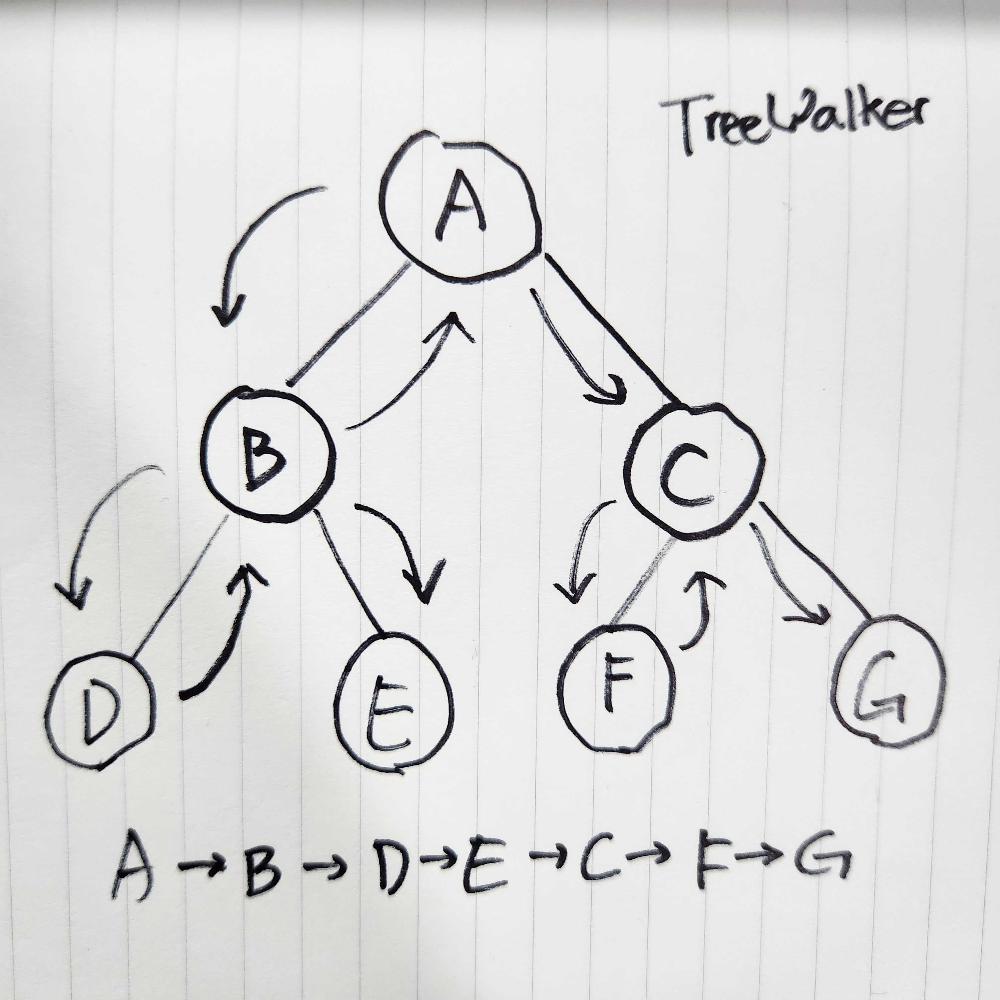

# 🖍 Attention

<div align="center">
  <b>긴 글 읽기를 돕는 크롬 익스텐션</b><br/>
  <b>서비스 자체 가이드라인 하이라이트와 자유로운 주석 표시 및 메모 기능 제공</b><br/>
  <a href="https://chromewebstore.google.com/detail/attention-web-reading-ass/hakidcoicmfocffkkkefhiifdahdaeme?authuser=0&hl=ko">[크롬 웹 스토어] 확장 프로그램: Attention - Web Reading Assistant</a>
</div>

<br />

<div align="center">
  
</div>

# 목차

<!-- toc -->

- [Motivation](#motivation)
- [Preview](#preview)
- [Development](#development)
  * [1. 웹 페이지의 스타일과 동작을 유지하며 하이라이트 기능을 제공하기: Custom Elements와 Shadow DOM](#1-%EC%9B%B9-%ED%8E%98%EC%9D%B4%EC%A7%80%EC%9D%98-%EC%8A%A4%ED%83%80%EC%9D%BC%EA%B3%BC-%EB%8F%99%EC%9E%91%EC%9D%84-%EC%9C%A0%EC%A7%80%ED%95%98%EB%A9%B0-%ED%95%98%EC%9D%B4%EB%9D%BC%EC%9D%B4%ED%8A%B8-%EA%B8%B0%EB%8A%A5%EC%9D%84-%EC%A0%9C%EA%B3%B5%ED%95%98%EA%B8%B0-custom-elements%EC%99%80-shadow-dom)
    + [1.1 고민: 기존 웹 페이지를 수정하지 않고 UI를 추가하는 방법은?](#11-%EA%B3%A0%EB%AF%BC-%EA%B8%B0%EC%A1%B4-%EC%9B%B9-%ED%8E%98%EC%9D%B4%EC%A7%80%EB%A5%BC-%EC%88%98%EC%A0%95%ED%95%98%EC%A7%80-%EC%95%8A%EA%B3%A0-ui%EB%A5%BC-%EC%B6%94%EA%B0%80%ED%95%98%EB%8A%94-%EB%B0%A9%EB%B2%95%EC%9D%80)
    + [1.2 문제점: 하이라이트 표시 관련 UI가 렌더링이 되지 않는다.](#12-%EB%AC%B8%EC%A0%9C%EC%A0%90-%ED%95%98%EC%9D%B4%EB%9D%BC%EC%9D%B4%ED%8A%B8-%ED%91%9C%EC%8B%9C-%EA%B4%80%EB%A0%A8-ui%EA%B0%80-%EB%A0%8C%EB%8D%94%EB%A7%81%EC%9D%B4-%EB%90%98%EC%A7%80-%EC%95%8A%EB%8A%94%EB%8B%A4)
    + [1.3 문제의 원인: 콘텐츠 스크립트의 격리된 실행 환경(Isolated Execution Environment)](#13-%EB%AC%B8%EC%A0%9C%EC%9D%98-%EC%9B%90%EC%9D%B8-%EC%BD%98%ED%85%90%EC%B8%A0-%EC%8A%A4%ED%81%AC%EB%A6%BD%ED%8A%B8%EC%9D%98-%EA%B2%A9%EB%A6%AC%EB%90%9C-%EC%8B%A4%ED%96%89-%ED%99%98%EA%B2%BDisolated-execution-environment)
    + [1.4 해결 과정: 격리된 실행 환경 내부에서 인라인 코드를 주입해보자.](#14-%ED%95%B4%EA%B2%B0-%EA%B3%BC%EC%A0%95-%EA%B2%A9%EB%A6%AC%EB%90%9C-%EC%8B%A4%ED%96%89-%ED%99%98%EA%B2%BD-%EB%82%B4%EB%B6%80%EC%97%90%EC%84%9C-%EC%9D%B8%EB%9D%BC%EC%9D%B8-%EC%BD%94%EB%93%9C%EB%A5%BC-%EC%A3%BC%EC%9E%85%ED%95%B4%EB%B3%B4%EC%9E%90)
    + [1.5 해결 방법 및 결과: 브라우저 확장 프로그램의 보안 정책으로 인해 외부 스크립트 파일을 생성하여 삽입해보자.](#15-%ED%95%B4%EA%B2%B0-%EB%B0%A9%EB%B2%95-%EB%B0%8F-%EA%B2%B0%EA%B3%BC-%EB%B8%8C%EB%9D%BC%EC%9A%B0%EC%A0%80-%ED%99%95%EC%9E%A5-%ED%94%84%EB%A1%9C%EA%B7%B8%EB%9E%A8%EC%9D%98-%EB%B3%B4%EC%95%88-%EC%A0%95%EC%B1%85%EC%9C%BC%EB%A1%9C-%EC%9D%B8%ED%95%B4-%EC%99%B8%EB%B6%80-%EC%8A%A4%ED%81%AC%EB%A6%BD%ED%8A%B8-%ED%8C%8C%EC%9D%BC%EC%9D%84-%EC%83%9D%EC%84%B1%ED%95%98%EC%97%AC-%EC%82%BD%EC%9E%85%ED%95%B4%EB%B3%B4%EC%9E%90)
  * [2. 하이라이트 및 드로잉 주석을 위한 별도의 독립적인 스타일 적용하기.](#2-%ED%95%98%EC%9D%B4%EB%9D%BC%EC%9D%B4%ED%8A%B8-%EB%B0%8F-%EB%93%9C%EB%A1%9C%EC%9E%89-%EC%A3%BC%EC%84%9D%EC%9D%84-%EC%9C%84%ED%95%9C-%EB%B3%84%EB%8F%84%EC%9D%98-%EB%8F%85%EB%A6%BD%EC%A0%81%EC%9D%B8-%EC%8A%A4%ED%83%80%EC%9D%BC-%EC%A0%81%EC%9A%A9%ED%95%98%EA%B8%B0)
    + [2.1 문제점: CSS 프레임워크인 TailwindCSS를 사용하니, UI(User Interface)의 스타일이 적용되지 않는다.](#21-%EB%AC%B8%EC%A0%9C%EC%A0%90-css-%ED%94%84%EB%A0%88%EC%9E%84%EC%9B%8C%ED%81%AC%EC%9D%B8-tailwindcss%EB%A5%BC-%EC%82%AC%EC%9A%A9%ED%95%98%EB%8B%88-uiuser-interface%EC%9D%98-%EC%8A%A4%ED%83%80%EC%9D%BC%EC%9D%B4-%EC%A0%81%EC%9A%A9%EB%90%98%EC%A7%80-%EC%95%8A%EB%8A%94%EB%8B%A4)
    + [2.2 해결 방법: 직접 빌드 단계에서 CSS를 변환 후 스타일로 주입하여 하이라이팅 기능 제공하기.](#22-%ED%95%B4%EA%B2%B0-%EB%B0%A9%EB%B2%95-%EC%A7%81%EC%A0%91-%EB%B9%8C%EB%93%9C-%EB%8B%A8%EA%B3%84%EC%97%90%EC%84%9C-css%EB%A5%BC-%EB%B3%80%ED%99%98-%ED%9B%84-%EC%8A%A4%ED%83%80%EC%9D%BC%EB%A1%9C-%EC%A3%BC%EC%9E%85%ED%95%98%EC%97%AC-%ED%95%98%EC%9D%B4%EB%9D%BC%EC%9D%B4%ED%8C%85-%EA%B8%B0%EB%8A%A5-%EC%A0%9C%EA%B3%B5%ED%95%98%EA%B8%B0)
- [User Experience](#user-experience)
  * [사용자 재방문 시, 생성했던 모든 드로잉 주석의 정확한 위치 복원하기.](#%EC%82%AC%EC%9A%A9%EC%9E%90-%EC%9E%AC%EB%B0%A9%EB%AC%B8-%EC%8B%9C-%EC%83%9D%EC%84%B1%ED%96%88%EB%8D%98-%EB%AA%A8%EB%93%A0-%EB%93%9C%EB%A1%9C%EC%9E%89-%EC%A3%BC%EC%84%9D%EC%9D%98-%EC%A0%95%ED%99%95%ED%95%9C-%EC%9C%84%EC%B9%98-%EB%B3%B5%EC%9B%90%ED%95%98%EA%B8%B0)
    + [1. 첫 번째 시도: 노드를 탐색하는 TreeWalker API를 활용하여 텍스트가 일치하는지 확인해보자.](#1-%EC%B2%AB-%EB%B2%88%EC%A7%B8-%EC%8B%9C%EB%8F%84-%EB%85%B8%EB%93%9C%EB%A5%BC-%ED%83%90%EC%83%89%ED%95%98%EB%8A%94-treewalker-api%EB%A5%BC-%ED%99%9C%EC%9A%A9%ED%95%98%EC%97%AC-%ED%85%8D%EC%8A%A4%ED%8A%B8%EA%B0%80-%EC%9D%BC%EC%B9%98%ED%95%98%EB%8A%94%EC%A7%80-%ED%99%95%EC%9D%B8%ED%95%B4%EB%B3%B4%EC%9E%90)
    + [2. 두 번째 시도와 성공: 특정 노드를 선택하는 쿼리 언어인 XPath를 활용하여 주석 위치 복원하기.](#2-%EB%91%90-%EB%B2%88%EC%A7%B8-%EC%8B%9C%EB%8F%84%EC%99%80-%EC%84%B1%EA%B3%B5-%ED%8A%B9%EC%A0%95-%EB%85%B8%EB%93%9C%EB%A5%BC-%EC%84%A0%ED%83%9D%ED%95%98%EB%8A%94-%EC%BF%BC%EB%A6%AC-%EC%96%B8%EC%96%B4%EC%9D%B8-xpath%EB%A5%BC-%ED%99%9C%EC%9A%A9%ED%95%98%EC%97%AC-%EC%A3%BC%EC%84%9D-%EC%9C%84%EC%B9%98-%EB%B3%B5%EC%9B%90%ED%95%98%EA%B8%B0)
    + [3. TreeWalker API와 XPath의 비교.](#3-treewalker-api%EC%99%80-xpath%EC%9D%98-%EB%B9%84%EA%B5%90)
- [Optimization](#optimization)
  * [사용자에게 더욱 자연스럽고 빠른 하이라이트 기능 제공하기.](#%EC%82%AC%EC%9A%A9%EC%9E%90%EC%97%90%EA%B2%8C-%EB%8D%94%EC%9A%B1-%EC%9E%90%EC%97%B0%EC%8A%A4%EB%9F%BD%EA%B3%A0-%EB%B9%A0%EB%A5%B8-%ED%95%98%EC%9D%B4%EB%9D%BC%EC%9D%B4%ED%8A%B8-%EA%B8%B0%EB%8A%A5-%EC%A0%9C%EA%B3%B5%ED%95%98%EA%B8%B0)
    + [1. 불필요한 사전 본문 파싱 방지를 위한 최적화: Intersection Observer](#1-%EB%B6%88%ED%95%84%EC%9A%94%ED%95%9C-%EC%82%AC%EC%A0%84-%EB%B3%B8%EB%AC%B8-%ED%8C%8C%EC%8B%B1-%EB%B0%A9%EC%A7%80%EB%A5%BC-%EC%9C%84%ED%95%9C-%EC%B5%9C%EC%A0%81%ED%99%94-intersection-observer)
    + [2. 본문을 읽을 때 발생하는 빈번한 스크롤 이벤트에 대한 최적화: requestAnimationFrame](#2-%EB%B3%B8%EB%AC%B8%EC%9D%84-%EC%9D%BD%EC%9D%84-%EB%95%8C-%EB%B0%9C%EC%83%9D%ED%95%98%EB%8A%94-%EB%B9%88%EB%B2%88%ED%95%9C-%EC%8A%A4%ED%81%AC%EB%A1%A4-%EC%9D%B4%EB%B2%A4%ED%8A%B8%EC%97%90-%EB%8C%80%ED%95%9C-%EC%B5%9C%EC%A0%81%ED%99%94-requestanimationframe)
- [Feature](#feature)
  * [1. 서비스 자체 하이라이트 표시: Reading Assistant Mode](#1-%EC%84%9C%EB%B9%84%EC%8A%A4-%EC%9E%90%EC%B2%B4-%ED%95%98%EC%9D%B4%EB%9D%BC%EC%9D%B4%ED%8A%B8-%ED%91%9C%EC%8B%9C-reading-assistant-mode)
  * [2. 유저 생성 주석 표시: Self-annotation Mode](#2-%EC%9C%A0%EC%A0%80-%EC%83%9D%EC%84%B1-%EC%A3%BC%EC%84%9D-%ED%91%9C%EC%8B%9C-self-annotation-mode)
  * [3. 아티클 관련 메모 작성 및 아카이빙 대시보드: Memo edit & archive Mode](#3-%EC%95%84%ED%8B%B0%ED%81%B4-%EA%B4%80%EB%A0%A8-%EB%A9%94%EB%AA%A8-%EC%9E%91%EC%84%B1-%EB%B0%8F-%EC%95%84%EC%B9%B4%EC%9D%B4%EB%B9%99-%EB%8C%80%EC%8B%9C%EB%B3%B4%EB%93%9C-memo-edit--archive-mode)
- [Tech stack](#tech-stack)
  * [1. Zustand](#1-zustand)
  * [2. ESBuild](#2-esbuild)
  * [3. PostCSS](#3-postcss)
- [Retrospect](#retrospect)
  * [1. 왜 indexedDB에 데이터를 저장하는 것으로 결정하게 되었을까?](#1-%EC%99%9C-indexeddb%EC%97%90-%EB%8D%B0%EC%9D%B4%ED%84%B0%EB%A5%BC-%EC%A0%80%EC%9E%A5%ED%95%98%EB%8A%94-%EA%B2%83%EC%9C%BC%EB%A1%9C-%EA%B2%B0%EC%A0%95%ED%95%98%EA%B2%8C-%EB%90%98%EC%97%88%EC%9D%84%EA%B9%8C)
  * [2. 향후 확장 계획.](#2-%ED%96%A5%ED%9B%84-%ED%99%95%EC%9E%A5-%EA%B3%84%ED%9A%8D)
  * [3. 팀 프로젝트와 개인 프로젝트의 차이점.](#3-%ED%8C%80-%ED%94%84%EB%A1%9C%EC%A0%9D%ED%8A%B8%EC%99%80-%EA%B0%9C%EC%9D%B8-%ED%94%84%EB%A1%9C%EC%A0%9D%ED%8A%B8%EC%9D%98-%EC%B0%A8%EC%9D%B4%EC%A0%90)

<!-- tocstop -->

---

# Motivation

요즘 사람들은 긴 글을 읽는 데 어려움을 겪거나 쉽게 집중력이 흐려지는 경우가 많습니다. 이 프로젝트는 그런 문제를 해결하고, 보다 **몰입감 있는 읽기 경험**을 제공하기 위해 시작되었습니다.

주요 블로그 플랫폼을 대상으로, 사용자가 효과적으로 글을 읽고 이해할 수 있도록 돕는 기능을 개발하였고 아래의 기대 효과를 달성할 수 있을 것이라 생각했습니다.

- **[서비스 자체 하이라이트 표시: Reading Assistant Mode]** <br/>
  현재 읽고 있는 문단이나 문장을 강조하여 자연스럽게 읽기에 집중할 수 있도록 유도
  - 짧은 글(문단 또는 문장)을 읽는 성취감을 반복적으로 느낄 수 있도록 설계하여 몰입감 유지

- **[유저 생성 주석 표시: Self-annotation Mode]** <br/>
  웹상에서 글을 읽을 때 지면의 글을 읽는 것처럼 텍스트에 하이라이트나 동그라미, 네모, 대괄호 등의 시각적 주석을 추가하여 자신만의 읽기 방식을 반영

- **[아티클 관련 메모 작성 및 아카이빙 대시보드: Memo edit & archive Mode]** <br/>
  글을 읽는 도중 다른 애플리케이션 등을 거치지 않고 메모 대시보드를 활용해 마크다운 형식으로 메모를 작성 및 관리

---

# Preview

**1. 서비스 자체 하이라이트 표시**

<div align="center">
  
</div>
<div align="center">
  
</div>
<div align="center">
  
</div>

<br />

**2. 유저 생성 주석 표시**

<div align="center">
  
</div>
<div align="center">
  
</div>

<br />

**3. 아티클 관련 메모 작성 및 아카이빙 대시보드**

**1) 메모 작성**

<div align="center">
  
</div>

<br />

**2) 메모 조회**

<div align="center">
  
</div>

<div align="center">
  
</div>

---

# Development

## 1. 웹 페이지의 스타일과 동작을 유지하며 하이라이트 기능을 제공하기: Custom Elements와 Shadow DOM

기획이 모두 끝나고 개발을 시작하면서 브라우저 확장 프로그램으로써의 기능 구현 및 화면 구성에 대해 고민하였습니다. 서비스의 주요 기능인 **서비스 하이라이트 및 드로잉 주석과, 그리고 대시보드 UI**는 다음과 같은 두 가지 중요한 요구사항을 충족해야 했습니다.

1. 기존 웹 페이지의 고유한 DOM과 스타일을 변경하지 않아야 한다. 
2. 동시에 웹 페이지의 스타일이나 동작에 영향을 받지 않아야 한다. 

---
 
### 1.1 고민: 기존 웹 페이지를 수정하지 않고 UI를 추가하는 방법은?

처음에는 기존 웹 페이지의 DOM을 직접 수정하여 하이라이트를 적용하는 방식을 고려했지만, 이 방법은 **기술적인 한계와 예상치 못한 부작용**을 초래할 가능성이 있다고 판단했습니다. 기존 웹 페이지의 요소를 직접 수정하면 예기치 않은 스타일 충돌 및 스크립트 간섭이 발생할 수 있는데, 대표적으로 아래와 같은 사례가 있습니다.

1. 스타일 충돌 문제
   - 웹 페이지에서 이미 정의된 스타일과 확장 프로그램의 스타일이 충돌하는 경우
2. `z-index` 충돌 문제
   - 확장 프로그램의 UI 요소(예: 툴팁, 대시보드)가 웹 페이지의 기존 UI 요소와 겹칠 경우
3. 사용자 이벤트 충돌 문제
   - 웹 페이지와 확장 프로그램이 같은 요소에 대해 `click` 이벤트를 바인딩하면 예상치 못한 동작 발생

이런 이유로 별도의 레이어를 구성하여 UI를 독립적으로 구현하고자 했고, 웹 표준 API인 `Shadow DOM`과 `Custom Element`를 알게 되었습니다. 이를 통해, 기존 웹 페이지와 완전히 분리된 상태에서 하이라이트 및 주석 레이어를 적용할 수 있었으며, 웹 페이지의 스타일 변경이나 스크립트 로직이 확장 프로그램의 기능에 영향을 주지 않도록 설계할 수 있었습니다.

| 개념           | 설명 |
|---------------|----------------------------------------------------------------------------------------------------------------------------------------------------------------------------------------------------------------------------------------------------------------|
| **Custom Element** | JavaScript API를 사용하여 새로운 사용자 정의 요소를 생성할 수 있는 기능입니다. HTML 요소의 기본 클래스인 `HTMLElement`을 상속받아 자율적인 사용자 정의 요소(Autonomous custom elements)로 구현됩니다. |
| **Shadow DOM** | 캡슐화를 제공하는 JavaScript API로, 특정 요소 내부의 DOM 트리를 외부 페이지의 JavaScript 및 CSS로부터 격리하는 역할을 합니다. 이를 통해 스타일과 기능을 보호하고 독립적인 웹 컴포넌트를 만들 수 있습니다. |
| **Shadow Tree** | Shadow DOM 내부에서 관리되는 별도의 DOM 트리로, 일반 DOM과 동일한 방식으로 노드를 추가하거나 속성을 설정할 수 있으며, `<style>` 요소를 통해 Shadow Tree 내부에 스타일을 설정할 수도 있습니다. |

|  |
|:--:|
| Shadow DOM 구조 |

---

### 1.2 문제점: 하이라이트 표시 관련 UI가 렌더링이 되지 않는다.

기본적으로 Custom Elements와 Shadow DOM을 활용하면 웹 페이지의 DOM을 침범하지 않고 독립적인 UI를 구성할 수 있습니다. 하지만, 실제 구현 과정에서 Custom Elements가 예상대로 생성되지 않거나, Shadow DOM 내부가 정상적으로 렌더링되지 않는 문제가 발생했습니다. <br />

- **Custom Elements가 생성되지 않는 문제**
  - 콘텐츠 스크립트 내부에서 `window.customElements.define()`을 통해 Custom Elements를 정의하려고 시도했지만, `window.customElements`가 `null`로 나타나는 현상이 발생했습니다.

- **Shadow DOM 내부가 렌더링되지 않는 문제**
  - Shadow DOM 내부에 React 컴포넌트가 렌더링되지 않았습니다.

- **콘텐츠 스크립트란(Content Script)란?**

콘텐츠 스크립트는 브라우저 확장 프로그램에서 웹 페이지의 DOM을 조작할 수 있도록 하는 JavaScript 파일입니다. 그러나 일반적인 웹페이지에서 실행되는 스크립트와는 몇 가지 차이점이 있습니다.

| 특성 | 설명 |
|------|------------------------------------------------------------------------------------------------------------------------------|
| **격리된 실행 환경(Isolated Execution Environment)** | 콘텐츠 스크립트는 웹 페이지의 JavaScript 실행 컨텍스트와 별개로 실행되며, 직접적으로 `window` 객체를 공유하지 않습니다. |
| **웹 페이지 DOM에 접근 가능** | 콘텐츠 스크립트는 웹 페이지의 DOM을 수정할 수 있지만, 웹 페이지에서 실행되는 스크립트와 전역 객체를 공유하지 않습니다. |
| **웹 페이지의 변수 접근 불가** | `window.variableName`과 같은 접근 방식으로 웹 페이지의 JavaScript 변수를 읽거나 수정할 수 없습니다. |
| **메시지 패싱 필요** | 백그라운드 스크립트 또는 팝업과 데이터를 주고받을 때 `chrome.runtime.sendMessage()`와 같은 API를 사용해야 합니다. |

|  |
|:--:|
|  |
| Custom Elements 생성 에러 |

---

### 1.3 문제의 원인: 콘텐츠 스크립트의 격리된 실행 환경(Isolated Execution Environment)

콘텐츠 스크립트는 웹 페이지의 DOM을 조작할 수 있지만, 웹 페이지의 JavaScript 실행 컨텍스트와는 완전히 분리된 **격리된 실행 환경(Isolated Execution Environment)**에서 동작합니다. 이는 보안과 안정성을 위해 설계된 구조로, 콘텐츠 스크립트가 웹 페이지의 JavaScript 코드와 직접적인 상호작용을 하지 못하도록 제한합니다.

- **콘텐츠 스크립트의 격리된 실행 환경으로 인해 발생하는 문제**

1. 전역 객체(`window`)를 공유할 수 없음
   - 콘텐츠 스크립트는 웹 페이지의 `window` 객체에 직접 접근할 수 없습니다.
   - 따라서, 웹 페이지에서 정의한 `customElements.define()`를 콘텐츠 스크립트에서 호출할 수 없습니다.

2. **웹 페이지의 JavaScript 변수 및 함수 접근 불가(실질적 원인)**
   - `window.customElements`는 웹 페이지의 JavaScript 실행 컨텍스트 내에서 관리됩니다.
   - 웹 페이지에서 선언한 전역 변수 및 함수는 콘텐츠 스크립트에서 직접 참조할 수 없습니다.
   - 예를 들어, 웹 페이지의 `window.customElements`나 특정 라이브러리 함수에 접근할 수 없습니다.

3. 보안 및 충돌 방지
   - 브라우저 확장은 웹 페이지와 분리된 실행 환경을 가짐으로써, 악의적인 웹사이트가 콘텐츠 스크립트를 조작하거나 데이터를 유출하는 것을 방지합니다.
   - 또한, 확장 프로그램의 스크립트가 웹 페이지의 JavaScript 코드와 충돌하지 않도록 격리된 환경을 유지합니다.

4. 브라우저 확장 전용 API 접근 가능
   - 콘텐츠 스크립트는 `chrome.runtime`, `chrome.storage` 등의 브라우저 확장 API에 접근할 수 있습니다.
   - 하지만, 기본적으로 웹 페이지에서 정의한 `Custom Elements`나 `Shadow DOM` API에는 직접 접근할 수 없습니다.

위와 같은 이유로, 콘텐츠 스크립트에서 Custom Elements 및 Shadow DOM을 정상적으로 등록하고 조작하기 위해서는 별도의 방법이 필요했습니다.

---

### 1.4 해결 과정: 격리된 실행 환경 내부에서 인라인 코드를 주입해보자.

콘텐츠 스크립트에서 `Custom Elements`을 정의할 수 없고 `Custom Elements`를 shadow host로 가질 `Shadow DOM`도 생성할 수 없다는 것을 알았습니다. 그로 인해, 콘텐츠 스크립트 자체에서 아래의 코드와 같이 Custom Elements와 Shadow DOM을 직접 인라인 코드로 정의하고 스크립트를 주입해보고자 했습니다. 그러나 브라우저 확장 프로그램의 **보안 정책(Content Security Policy, CSP)**에 의해 인라인 스크립트 실행이 차단되는 문제가 발생하였습니다. <br />

> content-script.js:41 Refused to execute inline script because it violates the following Content Security Policy directive: "script-src 'self' 'wasm-unsafe-eval' 'inline-speculation-rules' http://localhost:* http://127.0.0.1:*". Either the 'unsafe-inline' keyword, a hash ('sha256-AFeThEgz+MMrLLEvU9Imz1lrWV2iHNplblOMBCTko0c='), or a nonce ('nonce-...') is required to enable inline execution.

```tsx
const codeToInject = `
  (() => {
    /* Content Script 정의 및 Shadow DOM 생성 코드 */
  })();
`;

const script = document.createElement('script');
script.textContent = codeToInject;
(document.head || document.documentElement).appendChild(script);
script.remove();
```

이는 브라우저 확장 프로그램의 보안 정책에 의해 인라인 스크립트 실행이 기본적으로 차단되었기 때문입니다. 따라서, Custom Elements와 Shadow DOM을 콘텐츠 스크립트에서 직접 정의할 수 없으며, 웹 페이지 환경에서 실행해야 한다는 결론에 도달하였습니다. <br />

- **Content Security Policy(CSP)란?** <br />

CSP(Content Security Policy)는 웹 브라우저가 악의적인 코드 실행을 방지하기 위해 특정 유형의 콘텐츠 실행을 제한하는 보안 정책입니다. 이는 XSS(Cross-Site Scripting) 공격 방지를 주된 목표로 하며, 브라우저 확장 프로그램에도 적용됩니다.

|  |
|:--:|
| CSP 관련 도식 |

| 기능 | 설명 |
|------|------------------------------------------------------------------------------------------------------|
| **인라인 스크립트 차단** | `<script>` 태그에 직접 작성된 JavaScript 코드를 실행하지 못하도록 차단합니다. (`unsafe-inline` 필요) |
| **동적 스크립트 실행 제한** | `eval()` 또는 `Function()`과 같은 동적 코드 실행을 방지합니다. (`unsafe-eval` 필요) |
| **스크립트 소스 제한** | `script-src` 정책을 설정하여 특정 도메인의 스크립트만 허용할 수 있습니다. |
| **이미지, 스타일, 폰트 등의 리소스 제한** | `img-src`, `style-src`, `font-src` 등 특정 유형의 리소스 로딩을 제한할 수 있습니다. |

- 확장 프로그램은 **기본적으로 인라인 스크립트 실행을 허용하지 않으며**, 콘텐츠 스크립트 내부에서 인라인 스크립트를 통해 `Custom Elements` 및 `Shadow DOM`을 직접 정의하려고 했기에 CSP 정책 위반으로 실행이 차단되었습니다.
- 이를 해결하기 위해 **외부 스크립트 파일을 생성한 후, 이를 웹 페이지에 삽입하여 실행하는 방식**을 사용하고자 했습니다.

---

### 1.5 해결 방법 및 결과: 브라우저 확장 프로그램의 보안 정책으로 인해 외부 스크립트 파일을 생성하여 삽입해보자.

콘텐츠 스크립트에서는 Custom Elements와 Shadow DOM을 직접 정의할 수 없었기 때문에, 이를 웹 페이지 환경에서 실행되도록 외부 스크립트를 직접 만들어 주입하는 방식을 선택하였습니다. 이를 통해 window.customElements 같은 브라우저 API에 접근할 수 있었고, Custom Elements를 정상적으로 정의할 수 있었습니다. <br />

또한, Custom Elements가 아직 정의되지 않은 상태에서 Shadow DOM에 접근하려 하면 null이 발생하는 문제가 있었습니다. 이를 해결하기 위해 `customElements.whenDefined()` 메서드를 사용하여 Custom Elements가 정의될 때까지 대기하도록 하였습니다. <br />

Custom Elements가 정상적으로 정의된 후에는 window.postMessage를 사용하여 콘텐츠 스크립트로 이 정보를 전달하였으며, 콘텐츠 스크립트는 `window.addEventListener("message", callback)`을 통해 이를 감지하고, Shadow DOM 내부에 React 컴포넌트를 렌더링하는 방식으로 문제를 해결하였습니다.

```tsx
// injected-customElements-script.ts

(() => {
  /* Custom Elements 클래스 정의 및 Shadow DOM 정의 코드 */

  customElements.define('web-highlight-layer', WebHighlightLayer);
  customElements.define('web-dashboard', WebDashboard);

  const notifyCustomElementsReady = async () => {
    // Custom Element가 정의될 때까지 대기
    await customElements.whenDefined('web-highlight-layer');
    await customElements.whenDefined('web-dashboard');

    // Custom Element가 정의되면 콘텐츠 스크립트로 정보 전달
    window.postMessage({ type: 'ELEMENT_READY', element: 'web-highlight-layer' }, '*');
    window.postMessage({ type: 'ELEMENT_READY', element: 'web-dashboard' }, '*');
  };

  notifyCustomElementsReady();
})();
```

```tsx
// content-script/index.tsx

// 위의 스크립트를 삽입 후 삭제
const injectScript = async () => {
  const script = document.createElement('script');
  script.src = Browser.runtime.getURL('injected-customElements-script.js');
  (document.body || document.head || document.documentElement).appendChild(script);
  script.remove();
};

// 외부 스크립트의 정보가 전달오면
window.addEventListener('message', (event) => {
  if (event.data?.type === 'ELEMENT_READY' && event.data.element === 'web-highlight-layer') {
    /* ... */

    // 리액트 컴포넌트를 Shadow DOM 내부에 렌더링
    if (renderRoot) {
      createRoot(renderRoot).render(
        <StrictMode>
          <UserHighlightLayer />
          <ServiceHighlightLayer />
        </StrictMode>
      );
    }
  }
```

<br />

|  |
|:--:|
| 하이라이트 레이어 DOM 구조 |

|  |
|:--:|
| 대시보드 레이어 DOM 구조 |

---

## 2. 하이라이트 및 드로잉 주석을 위한 별도의 독립적인 스타일 적용하기.

### 2.1 문제점: CSS 프레임워크인 TailwindCSS를 사용하니, UI(User Interface)의 스타일이 적용되지 않는다.

Tailwind CSS는 전역 스타일을 기반으로 동작하며, 특정 클래스명을 요소에 적용하면 미리 정의된 스타일이 반영되는 방식으로 동작합니다. 그러나 **Shadow DOM은 전역 스타일을 참조하지 않는 독립적인 DOM 트리를 형성**하기 때문에, Tailwind의 전역 스타일이 Shadow DOM 내부 요소에 적용되지 않는 문제가 발생하였습니다. 즉, Shadow DOM 내부에 위치한 요소들은 Tailwind의 스타일을 인식하지 못하고, 기존 웹 페이지의 스타일과 완전히 격리된 상태로 렌더링되었습니다.

---

### 2.2 해결 방법: 직접 빌드 단계에서 CSS를 변환 후 스타일로 주입하여 하이라이팅 기능 제공하기.

TailwindCSS를 Shadow DOM 내부에서도 적용하기 위해, **빌드 과정에서 CSS를 문자열로 변환한 후 Shadow DOM 내부에 동적으로 삽입하는 방식**을 선택하였습니다. 이를 위해 **Esbuild와 PostCSS**를 활용하여 스타일을 최적화하고, 최종적으로 **Shadow DOM 내부의 `<style>` 태그에 직접 주입하는 방법**을 적용하였습니다.  

1. **Esbuild를 사용하여 React 컴포넌트를 번들링**  
   - 브라우저 확장 프로그램 관련 프레임워크 없이 **Esbuild를 활용해 직접 React 코드를 번들링**하였습니다.  
   - 불필요한 코드를 제거하기 위해 **Tree Shaking**을 활성화하고, **Minify** 옵션을 적용하여 최적화된 번들 파일을 생성하였습니다.

2. **PostCSS + cssnano를 활용하여 TailwindCSS 스타일을 최적화**  
   - PostCSS를 사용하여 TailwindCSS 스타일을 빌드 시 처리하였으며,  
   - `cssnano` 플러그인을 적용하여 **불필요한 스타일을 제거**하고 **최적화된 CSS를 추출**하였습니다.

3. **최적화된 TailwindCSS 스타일을 문자열로 변환한 후, Shadow DOM 내부에 주입**  
   - 빌드 과정에서 변환된 CSS를 `process.env.INLINE_CSS`에 저장한 후,  
   - Custom Elements의 `connectedCallback()` 내부에서 해당 CSS 문자열을 `<style>` 태그로 변환하여 Shadow DOM 내부에 삽입하였습니다.

```ts
// Esbuild를 사용하여 TailwindCSS 스타일을 문자열로 변환

const runEsbuild = async (inlineCSS) => {
  await esbuild.build({
    /* 옵션 관련 코드 */
    define: {
      'process.env.INLINE_CSS': JSON.stringify(inlineCSS),
    },
  });
};
```

```ts
// Shadow DOM 내부에 문자열로 변환된 CSS를 동적으로 삽입

connectedCallback() {
  if (!this.shadowRoot) {
    const shadowRoot = this.attachShadow({ mode: 'open' });

    // style 태그 생성 후 문자열 CSS 코드 삽입
    const styleTag = document.createElement('style');
    styleTag.textContent = process.env.INLINE_CSS as string;
    shadowRoot.appendChild(styleTag);

    const reactRoot = document.createElement('div');
    shadowRoot.appendChild(reactRoot);
  }
}
```

---

# User Experience

## 사용자 재방문 시, 생성했던 모든 드로잉 주석의 정확한 위치 복원하기.

사용자가 생성한 드로잉 주석이 브라우저 창 크기 변경 또는 페이지 재방문 시에도 **정확한 위치를 유지하도록 하는 것**은 중요한 사용자 경험 요소입니다. 그러나 document.body의 크기가 변하거나, 메모 대시보드를 ON/OFF할 때, 주석이 기존 위치에 고정된 채로 남아 있어 레이아웃이 자연스럽게 조정되지 않는 문제가 발생했습니다. 이를 해결하기 위해 **주석의 위치를 동적으로 재계산하는 방법**을 연구하였으며, 최종적으로 XPath를 활용하여 정확한 위치를 추적하는 방식으로 문제를 해결하였습니다.

### 1. 첫 번째 시도: 노드를 탐색하는 TreeWalker API를 활용하여 텍스트가 일치하는지 확인해보자.

브라우저 창 크기가 변경되거나 페이지를 다시 방문할 때, 사용자가 추가한 **드로잉 주석(하이라이트)의 위치를 올바르게 복원하는 것**이 필요했습니다. 이를 위해 주석이 적용된 텍스트와 정확히 일치하는 텍스트를 찾아 위치를 다시 계산하는 방안을 고려했습니다. <br />

첫 번째 시도로 **TreeWalker API**를 활용하여 문서의 텍스트 노드를 순회하면서 indexedDB에 저장된 주석의 textContent와 일치하는 노드를 찾고, 해당 노드의 getBoundingClientRect() 값을 이용해 주석을 재배치하는 방식을 구현하고자 했습니다.

- **TreeWalker API란?** <br />

**TreeWalker API**는 문서 내에서 특정 유형의 노드만 순회할 수 있도록 도와주는 **DOM 탐색 API**입니다. DFS(Depth-First Search) 방식으로 트리를 탐색합니다.
이는 `document.createTreeWalker()`를 사용하여 생성할 수 있으며, 특정 필터 조건을 설정하여 원하는 노드만 탐색할 수 있습니다. 

|  |
|:--:|
| DFS 도식화 |

| 특징 | 설명 |
|------|------------------------------------------------------------------------------------------------------|
| **특정 노드 유형만 필터링 가능** | `NodeFilter.SHOW_TEXT`를 설정하면 텍스트 노드만 순회할 수 있습니다. |
| **트리 구조를 깊이 우선 탐색** | DOM 트리 구조를 따라 **한 방향으로 순회**하며 노드를 찾습니다. |
| **현재 위치를 기억하며 이동** | `nextNode()`, `previousNode()` 등을 사용하여 특정 방향으로 이동할 수 있습니다. |
| **필터링 조건을 추가 가능** | `NodeFilter`를 활용해 원하는 조건에 맞는 노드만 `FILTER_ACCEPT`하도록 설정할 수 있습니다. |

---

```ts
// TreeWalker API 시도 코드

const findMatchingNode = (content: string, context: AnnotationInfo['context']) => {
  const walker = document.createTreeWalker(document.body, NodeFilter.SHOW_TEXT, {
    acceptNode: (node) => {
      /* 탐색 노드 조건 정립 */
    },
  });

  // DOM을 순회하며 매칭되는 노드를 찾음
  let currentNode = walker.nextNode();
  let combinedText = '';
  let firstNode: Node | null = null;
  let lastNode: Node | null = null;

  while (currentNode) {
    /* 관련 로직 */
  }

  if (combinedText.includes(content) && firstNode && lastNode) {
    return { firstNode, lastNode };
  }

  return null;
};
```

---

- **TreeWalker API 접근 방식의 실패 원인**<br />

1. **TreeWalker의 예상과 다른 순회 순서**  
   - TreeWalker API는 **DOM 구조를 기반으로 텍스트 노드를 순회**하지만, 줄 바꿈(`\n`)이나 공백이 포함된 경우 예상과 다르게 노드를 반환하는 문제가 있었습니다.  
   - 예를 들어, 여러 문단이 존재할 경우 **`<p>` 태그 내부에서 줄 바꿈된 텍스트가 여러 개의 텍스트 노드로 분리**될 수 있습니다.  
   - 이 과정에서 TreeWalker는 개별 텍스트 노드를 순회하는데, 특정 환경에서는 **줄 바꿈 문자(`\n`) 이후의 텍스트 노드를 먼저 탐색**하는 문제가 발생하였습니다.  

   **예제 시나리오**
   - "리액트 19로 업그레이드하기 전에 먼저 리액트 18.3으로 업그레이드하여 잠재적인 문제를 파악하시기를 권장합니다."  
   - 예상 순서:  
     ```
     "리액트 19로 업그레이드하기 전에 먼저 "
     "리액트 18.3으로 업그레이드하여 잠재적인 문제를 파악하시기를 권장합니다."
     ```
   - 실제 순서:
     ```
     "리액트 18.3으로 업그레이드하여 잠재적인 문제를 파악하시기를 권장합니다."
     "리액트 19로 업그레이드하기 전에 먼저 "
     ```

2. **텍스트 매칭 문제**
   - 줄 바꿈(\n), 공백( )이 포함된 경우 content와 nodeValue가 일치하지 않아 매칭이 실패하는 경우가 발생하였습니다.
   - 예외 처리를 추가하여 \n을 ""로 치환하는 방법도 시도했으나, **특정 환경에서는 원래의 텍스트 구조를 유지해야 하는 경우가 있어 적절하지 않은 방식**이라고 판단되었습니다.

|  |
|:--:|
| 실패 원인의 예시 이미지 |

---

### 2. 두 번째 시도와 성공: 특정 노드를 선택하는 쿼리 언어인 XPath를 활용하여 주석 위치 복원하기.


첫 번째 시도에서 사용한 TreeWalker API의 한계를 극복하기 위해, 주석을 생성할 당시의 **첫 번째 노드(`firstNode`)와 마지막 노드(`lastNode`)를 저장하는 방식**을 도입하였습니다. 완벽하게 일치하는 텍스트가 아니더라도 첫 번째 노드와 마지막 노드의 Path가 맞다면 일치하는 것으로 간주하기로 했습니다. 이때, **노드의 정확한 위치를 추적하기 위해 XPath(XML Path Language)를 활용**하기로 결정했습니다.

XPath는 **XML 및 HTML 문서 내 특정 요소의 고유한 경로를 식별하는 언어**로, 이를 활용하면 주석이 위치한 노드를 보다 안정적으로 찾을 수 있으며, **정확한 위치를 추적**할 수 있습니다.

- **해결 방법**<br />

1. **주석 생성 시, `firstNode`와 `lastNode`의 XPath를 저장**  
   - 사용자가 텍스트를 선택하여 주석을 생성할 때, `Range` 객체를 이용해 `firstNode`와 `lastNode`를 추출합니다.  
   - 해당 두 노드의 **XPath 경로를 생성하여 IndexedDB에 저장**합니다.  

2. **XPath를 통해 기존 노드를 정확히 찾아내는 함수 구현**  
   - `getNodeByXPath()` 함수를 사용하여 저장된 XPath 기반으로 **노드를 검색**합니다.  
   - `document.evaluate()` 메서드를 활용하여 XPath를 실행한 후, **해당하는 텍스트 노드를 반환**합니다.  
   - 요소 노드의 경우, 내부의 텍스트 노드까지 정확하게 추적하여 반환하도록 구현하였습니다.  

3. **위치 재계산 및 주석 복원**  
   - 검색된 `firstNode`와 `lastNode`를 기반으로 **새로운 `Range` 객체를 생성**합니다.  
   - `getBoundingClientRect()`를 사용하여 위치를 계산하고, 주석의 스타일을 갱신합니다.  
   - 만약 **해당 노드가 삭제되었거나, 기존 offset보다 텍스트 길이가 짧아진 경우, 주석을 자동으로 삭제**하여 불필요한 오류를 방지합니다.  

- **indexedDB에 저장된 주석 관련 데이터**

|  |
|:--:|
| IndexedDB에 저장된 주석 관련 데이터 |

---

1. createAnnotation 함수 내부의 XPath 표현식 생성 함수 (/hooks/useRoughNotation.ts)

```ts
const getXPath = (node: Node): string => {
  const paths: string[] = [];

  while (node) {
    if (node.nodeType === Node.ELEMENT_NODE) {
      /* 현재 요소의 XPath 경로를 paths 배열에 추가 */
    } else if (node.nodeType === Node.TEXT_NODE) {
      /* 텍스트 노드의 XPath 표현식을 paths 배열에 추가 */
    } else {
      break;
    }

    // 부모 노드로 이동하여 루프를 계속 진행
    if (node.parentNode) {
      node = node.parentNode;
    } else {
      break;
    }
  }

  return paths.length ? '/' + paths.join('/') : '';
};
```

2. 생성된 XPath 표현식으로부터 firstNode와 lastNode를 구하는 함수 (/hooks/useRoughNotation.ts)

```ts
const getNodeByXPath = useCallback(
  (xpath: string, documentRoot: Document = document): Node | null => {
    // XPath 표현식을 평가하여 첫 번째 매칭되는 노드를 가져옴
    const result = documentRoot.evaluate(
      xpath,
      documentRoot,
      null,
      XPathResult.FIRST_ORDERED_NODE_TYPE,
      null
    );

    // XPath 결과로 얻은 노드
    const node = result.singleNodeValue;

    // 만약 노드가 텍스트 노드라면 그대로 반환
    if (node?.nodeType === Node.TEXT_NODE) {
      return node;
    }

    if (node?.nodeType === Node.ELEMENT_NODE) {
      /* 요소 노드 관련 로직 */
    }

    return null;
  },
  []
);
```

3. 탐색한 firstNode, lastNode와 context로 저장했던 startOffset, endOffset를 활용하여 주석의 위치를 재계산하는 함수 (/hooks/useRoughNotation.ts)

```ts
requestAnimationFrame(() => {
  setRenderingAnnotations((prevAnnotations) => {
    return prevAnnotations
      .map((annotation) => {
        const { context } = annotation;
        const { firstNodeXPath, lastNodeXPath, startOffset, endOffset } = context;

        // XPath를 사용하여 firstNode와 lastNode 찾기
        const firstNode = getNodeByXPath(firstNodeXPath);
        const lastNode = getNodeByXPath(lastNodeXPath);

        // 노드와 오프셋이 유효한지 검사하는 함수
        const validateOffset = (node: Node, offset: number) => {
          if (node.nodeType !== Node.TEXT_NODE) return false;
          if (node.textContent === null) return false;
          if (offset > node.textContent.length) return false;

          return true;
        };

        if (
          firstNode !== null &&
          lastNode !== null &&
          validateOffset(firstNode, startOffset) &&
          validateOffset(lastNode, endOffset)
        ) {
          /* Range 객체 생성 후 선택된 영역의 크기 및 위치를 계산 */
        } else {
          // 유효하지 않은 경우 해당 주석을 삭제
          asyncDeleteHighlightById(annotation.id);

          return null;
        }
      })
      .filter(Boolean) as AnnotationInfo[]; // `null` 값을 필터링하여 유효한 주석만 유지
  });
});
```

---

### 3. TreeWalker API와 XPath의 비교.

TreeWalker API와 XPath는 둘 다 DOM 내에서 노드를 탐색하는 데 사용되지만, 방식과 목적이 다릅니다.

- **TreeWalker API**
  - **DOM을 순회하는 API**로, `document.createTreeWalker()`를 사용하여 특정 기준을 가진 노드만 순회할 수 있습니다.
  - **DFS(Depth-First Search) 방식**으로 트리를 탐색합니다.
  - `TreeWalker` 객체는 **현재 위치(currentNode)를 유지**하며, `nextNode()`, `previousNode()`, `parentNode()`, `firstChild()` 등의 메서드를 통해 노드를 이동할 수 있습니다.
  - 노드 필터링을 적용할 수 있어 특정 타입의 노드만 선택적으로 탐색할 수 있습니다.
  - 시간 복잡도
    - 최악의 경우: O(N) (모든 노드를 순회해야 할 경우)
    - 최선의 경우: O(1) (첫 번째 탐색한 노드가 정답일 경우)
    - 평균적인 경우: O(K) (K는 필터링 조건을 만족하는 노드 개수)

- **XPath**
  - **DOM에서 특정 노드를 선택하는 쿼리 언어**입니다.
  - SQL과 비슷한 개념으로, 특정 패턴을 만족하는 노드를 반환합니다.
  - `document.evaluate()`를 사용하여 XPath 쿼리를 실행하며, `Result` 객체로 결과를 받습니다.
  - **DFS 방식은 아니며**, 문서 전체를 대상으로 조건에 맞는 노드를 찾는 방식입니다.
  - 시간 복잡도
    - 최악의 경우: O(N) (트리 전체를 검색해야 하는 복잡한 XPath 쿼리 사용 시)
    - 최선의 경우: O(1) (특정 요소를 ID 기반으로 찾거나, 특정 노드에 대한 직접적인 경로를 제공할 경우)
    - 평균적인 경우: O(log N) (트리의 특정 노드에 도달하는 데 필요한 경로가 로그 스케일일 경우)
    - XPath는 특정 경로 기반으로 탐색하며, 최적화된 검색을 수행할 수 있어 O(log N) 또는 O(1)에 가깝게 동작하는 경우가 많습니다. 
    - 따라서, 일반적으로 XPath가 TreeWalker보다 빠르며, 특히 특정 요소를 찾는 경우 XPath가 더욱 효과적입니다.

| 비교 항목 | TreeWalker API | XPath |
|-----------|----------------|--------|
| **작동 방식** | DOM 트리를 순회하면서 특정 노드 필터링 | 고유한 경로를 기반으로 특정 노드를 직접 탐색 |
| **속도** | 순차 탐색이므로 노드가 많아질수록 느려질 수 있음 | 특정 노드를 바로 찾을 수 있어 상대적으로 빠름 |
| **정확성** | 줄 바꿈(`\n`) 등의 이유로 예상과 다르게 순회할 수 있음 | HTML 구조가 변하지 않는 한, 일관된 노드 추적 가능 |
| **활용 가능성** | 특정 노드들을 조건에 맞게 필터링하면서 탐색할 때 유용 | 특정 요소를 **고정된 경로**로 추적할 때 효과적 |
| **제한 사항** | 텍스트가 여러 노드로 분리될 경우 매칭이 어려움 | DOM 구조가 변하면 XPath가 유효하지 않을 수 있음 |
| **평균적인 시간 복잡도** | O(K) (K는 필터링 조건을 만족하는 노드 개수) | O(log N) (트리에서 특정 노드에 도달하는 최적화된 경우) |


---

# Optimization

## 사용자에게 더욱 자연스럽고 빠른 하이라이트 기능 제공하기.

블로그나 정보 글이 많은 웹 페이지에서 **효율적으로 문장을 파싱하고 관리하는 방법**을 고민하였습니다. 웹 페이지 본문의 경우, 주로 `<p>`, `<li>`, `<h1>`, `<h2>`, `<h3>`, `<pre>` 등의 특정 태그로 구성된다는 점을 활용하여, 불필요하게 모든 본문을 모두 파싱하는 것이 아니라 **뷰포트 내에서만 해당 요소들을 감지하고 관리하는 방식**을 적용하였습니다.

이를 위해 **Intersection Observer API**를 활용하여 뷰포트 내 요소만 상태로 관리하고, 추가적으로 스크롤 이벤트 최적화를 통해 불필요한 연산을 줄이는 방식을 도입하였습니다. 특히, DOMRect API를 이용하여 요소의 위치와 크기를 계산하고, throttle 및 requestAnimationFrame을 활용하여 성능을 최적화하는 방식을 적용하였습니다.

### 1. 불필요한 사전 본문 파싱 방지를 위한 최적화: Intersection Observer

웹 페이지의 특정 요소(`<p>`, `<li>`, `<h1>`, `<h2>`, `<h3>`, `<pre>` 등)를 대상으로 **읽기 가이드라인을 제공하기 위해 상태 값으로 관리**해야 했습니다. 그러나 단순히 웹 페이지에 접속하자마자 아직 읽지 않은 본문의 **모든 요소를 미리 순회하며 상태 값을 관리하는 방식**은 다음과 같은 비효율적인 문제가 있었습니다.  

- 뷰포트 밖의 요소까지 상태 값으로 포함 → 불필요한 연산 증가
- 스크롤 및 DOM 변경 이벤트마다 전체 요소를 다시 계산 → 성능 저하 우려

- **해결 방법**

1. **뷰포트 내 요소만 감지**  
   - `Intersection Observer API`를 활용하여 **뷰포트에 들어오거나 나가는 요소만 감지**하도록 설정하였습니다.  
   - 이를 통해 **뷰포트 외부의 요소는 연산 대상에서 제외**하여 불필요한 연산을 줄였습니다.  

2. **DOMRect를 활용한 요소 크기 및 위치 계산**  
   - `IntersectionObserver` 콜백 함수가 실행될 때, **`entry.target`을 이용하여 해당 요소의 `DOMRect` 정보를 추출**하였습니다.  
   - 이를 통해 **뷰포트 내에서 요소가 어느 위치에 존재하는지 정확히 측정**할 수 있었습니다.  

3. **상태 업데이트 최적화**  
   - `entry.isIntersecting` 값을 활용하여 **뷰포트에 들어온 요소만 상태 값에 추가**하고, **뷰포트에서 벗어난 요소는 제거**하였습니다.  
   - 중복 데이터를 방지하기 위해 **요소의 `textContent`와 크기(`width`, `height`)를 조합하여 고유한 키를 생성**하였습니다.  

이 방식으로 **불필요한 연산을 최소화하면서도, 필요한 데이터만 효율적으로 관리**할 수 있었습니다. 

---

### 2. 본문을 읽을 때 발생하는 빈번한 스크롤 이벤트에 대한 최적화: requestAnimationFrame

`Intersection Observer`를 통해 **뷰포트에 들어오거나 나가는 요소는 감지할 수 있었지만**,  
뷰포트 내에서 **이미 표시되고 있는 요소의 상태 업데이트는 즉시 반영되지 않는 문제**가 있었습니다.  

- 스크롤 이벤트 중, 화면 내 요소가 그대로 유지되는 경우 Intersection Observer가 동작하지 않음
- 스크롤 이벤트가 초당 수백 번 발생하며, 이를 직접 처리하면 성능 저하와 프레임 드롭 발생 가능

- **해결 방법**

1. **스크롤 시 요소 상태 업데이트**  
   - `requestAnimationFrame`을 사용하여 **스크롤 중에도 현재 뷰포트 내 요소들의 위치를 `DOMRect`를 통해 재계산**하였습니다.  
   - 이를 통해 **Intersection Observer가 감지하지 못하는 요소들도 실시간으로 반영할 수 있도록 개선**하였습니다.  

2. **스로틀링(throttling) 적용**  
   - 스크롤 이벤트 핸들러가 너무 자주 호출되지 않도록 **`throttle`을 적용하여 100ms 간격으로 실행**하도록 설정하였습니다.  
   - 이를 통해 **이벤트 호출 빈도를 제한하여 성능 저하를 방지**하였습니다.  

3. **requestAnimationFrame과 결합하여 렌더링 최적화**  
   - `requestAnimationFrame`은 **브라우저의 화면 갱신 주기에 맞춰 콜백을 실행**하는 API입니다.  
   - 디스플레이가 60Hz라면 16.66ms(1s/60)마다 한 번씩 화면이 갱신되므로, 이 주기에 맞춰 **뷰포트 내 요소 위치를 업데이트**하였습니다.  
   - `throttle`과 `requestAnimationFrame`을 함께 사용함으로써 **비싼 DOM 연산(`getBoundingClientRect()`)을 최소한의 비용으로 실행**할 수 있도록 최적화하였습니다.  

---

# Feature

## 1. 서비스 자체 하이라이트 표시: Reading Assistant Mode

- 하이라이트 바 (ON/OFF)
  - 하이라이팅할 요소들을 선별하여 DOM 파싱
  - 하이라이트 바의 노란색 영역에 마우스를 올리면 해당 영역과 수평 위치에 있는 문장 또는 문단이 하이라이팅

- 키보드 모드 기능 (ON/OFF)
  - 하이라이트 바의 노란색 영역 클릭 또는 키보드 아이콘 클릭 시 진입
  - ↑, ↓, SpaceBar: 하이라이팅 위치를 이동하고 고정
  - Esc(escape): 키보드 모드 종료

## 2. 유저 생성 주석 표시: Self-annotation Mode

- 텍스트에 하이라이트, 동그라미, 네모, 대괄호 등 다양한 시각적 주석 추가 기능 제공 (지면의 글을 읽는 것처럼 직관적으로 표시 가능)
- 주석의 타입 변경, 삭제, ON/OFF 기능 지원
- 생성된 주석을 브라우저의 `indexedDB`에 저장해 해당 페이지를 재방문 시 주석을 그대로 복원하여 표시

## 3. 아티클 관련 메모 작성 및 아카이빙 대시보드: Memo edit & archive Mode

- 웹 페이지 본문 옆 사이드 영역에 메모용 대시보드 표시 (ON/OFF)
- 메모를 마크다운 형식으로 생성, 조회, 수정, 삭제(CRUD) 가능
- 작성된 메모는 브라우저의 `indexedDB`와 동기화되어 데이터 영속성 보장
- 서비스 자체 하이라이트의 키보드 모드 동작 시, 하이라이트 된 텍스트를 즉시 복사할 수 있는 기능 제공

---

# Tech stack

<div align="left">
  
  
  
  
  
  
</div>

## 1. Zustand

- 대시보드와 하이라이트 레이어의 렌더링 루트를 `Custom Elements`와 `Shadow DOM`을 통해 DOM 상에서 각각 별도의 위치에 두었기 때문에, 중앙 집중형의 전역 상태 관리가 필요하였습니다.
- 추가적인 라이브러리 설치 없이 간결한 훅 기반 API를 제공하여, 스토어 생성 및 상태 관리를 빠르고 직관적으로 구현할 수 있습니다.

- **실제 코드**

```ts
// modalSlice.ts

type modalType = 'confirm' | 'informCopyHighlight' | 'informNoMemoTitle' | 'informNoMemoContent';

interface ModalState {
  openModalTypeList: modalType[];
  addModal: (modalType: modalType) => void;
  closeModal: (modalType: modalType) => void;
  clearOpenModalTypeList: () => void;
}

export const createModalSlice: StateCreator<ModalState> = (set) => ({
  openModalTypeList: [],
  addModal: (modalType) =>
    set((state) => ({ openModalTypeList: [...state.openModalTypeList, modalType] })),
  closeModal: (modalType) =>
    set((state) => ({
      openModalTypeList: state.openModalTypeList.filter((name) => name !== modalType),
    })),
  clearOpenModalTypeList: () => set(() => ({ openModalTypeList: [] })),
});
```

---

## 2. ESBuild

- React를 활용한 브라우저 확장 프로그램 개발에서는 모듈화되어 있는 여러 파일을 **빠르게 content-script, background와 같은 스크립트로 번들링**하여 변경 사항에 대한 결과물을 확인할 필요가 있었습니다.
- Esbuild의 `define` 옵션을 PostCSS와 함께 사용하여 빌드 시점에 `process.env.INLINE_CSS`을 문자열 CSS로 대체하였습니다. 대체된 문자열 CSS는 `shadow DOM` 내부의 `<style>` 태그의 내용으로 주입하였습니다.

- **실제 코드**

```js
const runEsbuild = async (inlineCSS) => {
  await esbuild.build({
    entryPoints: [
      'src/content-script/index.tsx',
      'src/content-script/injected-customElements-script.ts',
      'src/background/index.ts',
    ],
    bundle: true,
    outdir: outdir,
    treeShaking: true,
    minify: true,
    legalComments: 'none',
    jsx: 'automatic',
    define: {
      'process.env.INLINE_CSS': JSON.stringify(inlineCSS),
    },
  });
};
```

---

## 3. PostCSS

- 브라우저 확장 프로그램에 대한 개발이었기 때문에 DOM을 직접 조작하지 않고 **`Shadow DOM`을 활용해 격리된 스타일링**을 하였습니다.
- 이를 위해 **PostCSS를 사용해 플러그인 배열을 전달, process 메서드를 통해 CSS 문자열을 반환**받았습니다. 이 CSS 문자열을 Shadow DOM 내부의 `<style>` 태그에 동적으로 주입하여 Shadow DOM 내부에서 스타일을 적용하였습니다.

- **사용한 플러그인**

1. TailwindCSS의 PostCSS 플러그인
   - `@tailwind base`, `@tailwind components`, `@tailwind utilities` 와 `tailwind.config.js`을 기반으로 최종 CSS 생성

2. Autoprefixer
   - 브라우저 호환성을 위해 벤더 접두사(prefixer) 추가

3. CSSNano
   - CSS 압축 및 로딩 속도 최적화

4. PostCSS Preset Env
   - 구형 브라우저에서도 동작할 수 있도록 대상 브라우저 또는 런타임 환경에 맞는 폴리필 결정
   - 최신 CSS를 대부분의 브라우저에서 이해할 수 있는 CSS로 변환 (`stage: 2`로 안정적인 최신 CSS 기능만 사용)

```js
const buildCSS = async () => {
  const css = `
    @import url('https://cdn.jsdelivr.net/gh/orioncactus/pretendard@v1.3.9/dist/web/static/pretendard-dynamic-subset.min.css');
    @tailwind base;
    @tailwind components;
    @tailwind utilities;

    @layer utilities {
      .flex-center {
        @apply flex flex-row items-center justify-center;
      }
      .flex-col-center {
        @apply flex flex-col items-center justify-center;
      }
    }
  `;

  const result = await postcss([
    tailwindcss,
    autoprefixer,
    cssnano({
      preset: 'default',
    }),
    postcssPresetEnv({
      stage: 2,
      autoprefixer: { grid: true },
    }),
  ]).process(css, { from: undefined });

  return result.css;
};
```

---

# Retrospect

## 1. 왜 indexedDB에 데이터를 저장하는 것으로 결정하게 되었을까?

- 개발 일정과 배포 효율성 고려
  - 로그인 및 회원가입은 확장 프로그램을 사용하는 사용자들에게 큰 허들이 될 수 있다고 생각했습니다. 또한, 로그인 기능이나 외부 서버와의 통신을 구현하는 데에는 추가적인 개발 시간과 복잡성이 요구됩니다.
  - 서비스 초기 단계에서는 로컬 스토리지인 IndexedDB를 활용하여 MVP 기능을 구현하고, 사용자 경험을 검증하는 데 집중했습니다. 이후 서비스가 안정화되고 사용자 수가 증가한다면, 클라우드 기반 데이터베이스와의 통합을 검토할 계획입니다.

- 대용량 데이터 처리 가능
  - IndexedDB는 브라우저 스토리지 중에서도 상대적으로 큰 용량을 저장할 수 있어, 사용자가 작성한 많은 양의 메모와 드로잉 주석도 안정적으로 관리할 수 있습니다.

## 2. 향후 확장 계획.

- 공통
  - 한영 언어 전환 기능: 로컬 스토리지에 이전 선택 언어를 기억, 이후 방문 시 해당 언어로 서비스 제공
  - 로그인 및 회원가입 기능: 유저의 메모와 드로잉 주석을 클라우드에 저장하고, 브라우저 간 동기화 지원
  - 다크모드 지원: 서비스가 웹 페이지의 다크 모드와 조화를 이루도록, 하이라이트와 UI가 다크 모드와 호환되도록 설계
  - 지원 웹 사이트 확장 => 현재는 `velog` 및 `tistory`만 지원. 특정 페이지는 div 태그로 본문의 text 노드가 감싸진 것을 확인하였는데, div 태그를 허용하는 순간 하이라이트 바의 노란 박스가 겹쳐지는 현상이 발생

- 서비스 자체 하이라이트 표시: Reading Assistant Mode
  - 하이라이트 색상 선택 기능
  - `resize` 및 `mutation` 이벤트에 따른 하이라이트 위치 및 크기 즉시 업데이트 보완 => 현재 `ResizeObserver` 및 `MutationObserver`를 활용한 로직이 구현되어 있지만, 제대로 작동하지 않는 것을 확인

- 유저 생성 주석 표시: Self-annotation Mode
  - 대시보드를 활용하여 유저 생성 주석이 적용된 노드들의 content를 따로 추출하여 드로잉 주석 모아보기 기능
  - 하이라이트 텍스트 복사 기능

- 메모 기능 개선
  - 비개발자나 Markdown을 모르는 사용자를 위한 일반 텍스트 편집기(WYSIWYG: What You See Is What You Get) 지원

## 3. 팀 프로젝트와 개인 프로젝트의 차이점.

- 팀 프로젝트

팀 프로젝트는 **멀티 스레드 프로세스**에 비유할 수 있을 것 같습니다. 각 팀원이 병렬적으로 각자 다른 관점에서 아이디어를 제안하고 발전시키고 미팅을 통해 이를 공유하였습니다. 서로가 서로의 기폭제가 되어 주며 작업을 나누어 진행하면서, 프로젝트 완성이라는 목표를 향해 동시에 나아갔습니다. 놓친 부분이나 모르는 점을 보완해 주고, 반복 작업도 분담하여 효율성을 높일 수 있습니다. 한 명이 잠시 쉬더라도 다른 팀원이 작업을 이어갈 수 있어 프로젝트는 꾸준히 진행되었습니다. 그러나 리소스를 공유하는 과정에서 git 충돌이 발생하기도 하였고, 서로의 의견을 공유할 때는 의견 충돌이 발생할 때도 있었습니다. 또, 모든 결정을 최대한 동의로 이끌어야 해서 진행 속도가 느려질 때도 있었습니다.

- 개인 프로젝트

개인 프로젝트는 **싱글 스레드 프로레스**와 같았습니다. 아이디어를 고민하고 결정하는 것부터 모든 기능 구현과 배포까지 모든 작업을 혼자 순차적으로 진행하며 프로젝트의 전체적인 흐름을 파악할 수 있었습니다. 계획 했던 일이 모두 끝나서 스택이 모두 비워지면 원하는대로 구현된 기능을 보완하거나 새로운 기능과 기술에 대한 구상을 자유롭게 했습니다. 작업 중 모르는 부분이 있거나 진행이 막히면, 필요한 경우 인터넷 검색이나 동료를 통해 비동기적으로 도움을 얻을 수 있었습니다. 그러나 이러한 도움은 팀 프로젝트처럼 병렬적으로 이루어지는 것은 아니었으므로, 결국 스스로 해결해야 할 책임이 컸습니다. 자유롭게 진행 방향을 수정할 수는 있으나, 추가 학습도 온전히 혼자 감당해야 했으며, 프로젝트가 복잡해질수록 특정 기술 스택에 대한 지식은 온전히 나 자신만이 알게 되어 도움을 요청하기도 어려웠습니다. 이 과정에서 좌절할 때도 있었지만, 문제를 해결하며 성취감을 느끼고 성장하는 제 자신을 발견했습니다.

<br />
